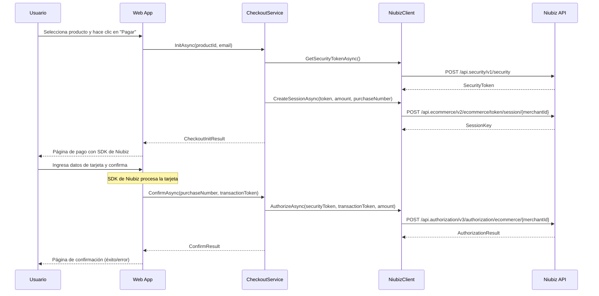

# 🔗 Integración Niubiz Demo

[](https://dotnet.microsoft.com/)
[](LICENSE)

**Ejemplo de integración con la plataforma de pagos Niubiz para desarrolladores terceros**

Este repositorio proporciona un ejemplo completo de cómo integrar la plataforma de pagos **Niubiz** en una aplicación web .NET 8, implementando un flujo de e-commerce completo desde la selección de productos hasta la confirmación del pago.

## 📋 Tabla de Contenidos

- [Introducción](#-introducción)
- [Arquitectura](#-arquitectura)
- [Requisitos Previos](#-requisitos-previos)
- [Configuración](#-configuración)
- [APIs Disponibles](#-apis-disponibles)
- [Flujo de Pago](#-flujo-de-pago)
- [Guía de Integración](#-guía-de-integración)
- [Ejemplos de Uso](#-ejemplos-de-uso)
- [Troubleshooting](#-troubleshooting)
- [Contribución](#-contribución)

## 🎯 Introducción

**Niubiz** es la plataforma de pagos digitales líder en Perú, que permite a los comercios procesar pagos con tarjetas de crédito y débito de forma segura. Este proyecto demuestra:

- ✅ Integración completa con la API de Niubiz
- ✅ Implementación de Clean Architecture
- ✅ Flujo de checkout seguro
- ✅ Manejo de tokens y sesiones
- ✅ Configuración por ambientes (QA/Producción)
- ✅ Logging y manejo de errores

## 🏗️ Arquitectura

El proyecto implementa **Clean Architecture** con separación clara de responsabilidades:

```
┌─────────────────────────────────────────────────────────────┐
│                     Capa de Presentación                    │
│                  (IntegracionNiubizDemo.Web)                │
│  ┌─────────────┐  ┌─────────────┐  ┌─────────────────────┐  │
│  │ Controllers │  │    Views    │  │   Static Content    │  │
│  └─────────────┘  └─────────────┘  └─────────────────────┘  │
└─────────────────────────────────────────────────────────────┘
                                ↓
┌─────────────────────────────────────────────────────────────┐
│                     Capa de Aplicación                      │
│               (IntegracionNiubizDemo.Application)           │
│  ┌─────────────┐  ┌─────────────┐  ┌─────────────────────┐  │
│  │  Services   │  │ Interfaces  │  │        DTOs         │  │
│  └─────────────┘  └─────────────┘  └─────────────────────┘  │
└─────────────────────────────────────────────────────────────┘
                                ↓
┌─────────────────────────────────────────────────────────────┐
│                   Capa de Infraestructura                   │
│              (IntegracionNiubizDemo.Infrastructure)         │
│  ┌─────────────┐  ┌─────────────┐  ┌─────────────────────┐  │
│  │ NiubizClient│  │ HttpClient  │  │  Configuración      │  │
│  └─────────────┘  └─────────────┘  └─────────────────────┘  │
└─────────────────────────────────────────────────────────────┘
                                ↓
┌─────────────────────────────────────────────────────────────┐
│                    Capa de Persistencia                     │
│               (IntegracionNiubizDemo.Persistence)           │
│  ┌─────────────┐  ┌─────────────┐  ┌─────────────────────┐  │
│  │ Repositories│  │  DbContext  │  │      SQLite         │  │
│  └─────────────┘  └─────────────┘  └─────────────────────┘  │
└─────────────────────────────────────────────────────────────┘
                                ↓
┌─────────────────────────────────────────────────────────────┐
│                      Capa de Dominio                        │
│                 (IntegracionNiubizDemo.Domain)              │
│  ┌─────────────┐  ┌─────────────┐  ┌─────────────────────┐  │
│  │  Entities   │  │ Value Objs  │  │   Business Rules    │  │
│  │             │  │             │  │                     │  │
│  │  Product    │  │             │  │  (Lógica central)   │  │
│  │  Order      │  │             │  │                     │  │
│  │  Payment    │  │             │  │                     │  │
│  └─────────────┘  └─────────────┘  └─────────────────────┘  │
└─────────────────────────────────────────────────────────────┘
```

### Descripción de Capas

#### 🎨 **Capa de Presentación (Web)**
- **Responsabilidad**: Interfaz de usuario y manejo de peticiones HTTP
- **Componentes**:
  - `ProductsController`: Gestión y visualización de productos
  - `CheckoutController`: Proceso de pago y checkout
  - `HomeController`: Página principal
- **Tecnologías**: ASP.NET Core MVC, Razor Views, Bootstrap

#### 🧠 **Capa de Aplicación**
- **Responsabilidad**: Lógica de negocio y orquestación de servicios
- **Componentes**:
  - `ICheckoutService`: Servicio de checkout y pagos
  - `IProductService`: Gestión de productos
  - `INiubizGateway`: Interfaz para integración con Niubiz
- **Patrones**: Repository Pattern, Dependency Injection

#### 🔧 **Capa de Infraestructura**
- **Responsabilidad**: Implementaciones concretas e integraciones externas
- **Componentes**:
  - `NiubizClient`: Cliente HTTP para API de Niubiz
  - `NiubizOptions`: Configuración de Niubiz
  - `DependencyInjection`: Registro de servicios
- **Tecnologías**: HttpClient, Options Pattern

#### 💾 **Capa de Persistencia**
- **Responsabilidad**: Acceso a datos y persistencia
- **Componentes**:
  - `AppDbContext`: Contexto de Entity Framework
  - `ProductRepository`, `OrderRepository`, `PaymentRepository`
- **Tecnologías**: Entity Framework Core, SQLite

#### 🏛️ **Capa de Dominio**
- **Responsabilidad**: Entidades de negocio y reglas fundamentales
- **Entidades**:
  - `Product`: Información de productos
  - `Order`: Órdenes de compra
  - `PaymentTransaction`: Transacciones de pago

## 📋 Requisitos Previos

- [.NET 8 SDK](https://dotnet.microsoft.com/download/dotnet/8.0)
- Una cuenta de comercio en [Niubiz](https://www.niubiz.com.pe/)
- Credenciales de acceso (Merchant ID, Username, Password)

## ⚙️ Configuración

### 1. Clonación del Repositorio

```bash
git clone https://github.com/eincioch/IntegracionNiubizDemo.git
cd IntegracionNiubizDemo
```

### 2. Configuración de Niubiz

Crea un archivo `appsettings.Development.json` o usa **User Secrets**:

```json
{
  "Niubiz": {
    "Environment": "qa",
    "MerchantId": "TU_MERCHANT_ID",
    "Username": "TU_USERNAME", 
    "Password": "TU_PASSWORD",
    "Currency": "PEN",
    "BaseUrls": {
      "qa": "https://apisandbox.vnforapps.com",
      "prod": "https://apiprod.vnforapps.com"
    },
    "StaticContent": {
      "qa": "https://static-content-qas.vnforapps.com/v2/js/checkout.js?qa=true",
      "prod": "https://static-content.vnforapps.com/v2/js/checkout.js"
    }
  }
}
```

### 3. Configuración con User Secrets (Recomendado)

```bash
cd IntegracionNiubizDemo.Web
dotnet user-secrets set "Niubiz:MerchantId" "TU_MERCHANT_ID"
dotnet user-secrets set "Niubiz:Username" "TU_USERNAME"
dotnet user-secrets set "Niubiz:Password" "TU_PASSWORD"
```

### 4. Ejecutar la Aplicación

```bash
dotnet run --project IntegracionNiubizDemo.Web
```

La aplicación estará disponible en `https://localhost:7001`

## 🔌 APIs Disponibles

### Endpoints Principales

| Método | Endpoint | Descripción |
|--------|----------|-------------|
| `GET` | `/` | Página principal con lista de productos |
| `GET` | `/checkout/pay/{productId}` | Inicializar proceso de pago |
| `POST` | `/checkout/confirm` | Confirmar transacción de pago |

### Servicios de Aplicación

#### ICheckoutService

```csharp
public interface ICheckoutService
{
    // Inicializa el proceso de checkout para un producto
    Task<CheckoutInitResult> InitAsync(Guid productId, string? customerEmail, CancellationToken ct = default);
    
    // Confirma el pago con el token de transacción
    Task<ConfirmResult> ConfirmAsync(string purchaseNumber, string transactionToken, CancellationToken ct = default);
}
```

#### INiubizGateway

```csharp
public interface INiubizGateway
{
    // Obtiene token de seguridad para autenticación
    Task<string> GetSecurityTokenAsync(CancellationToken ct = default);
    
    // Crea sesión de pago en Niubiz
    Task<string> CreateSessionAsync(string securityToken, decimal amount, string purchaseNumber, string currency, CancellationToken ct = default);
    
    // Autoriza la transacción de pago
    Task<AuthorizationResult> AuthorizeAsync(string securityToken, string transactionToken, decimal amount, string currency, string purchaseNumber, CancellationToken ct = default);
}
```

### DTOs (Data Transfer Objects)

#### CheckoutInitResult
```csharp
public record CheckoutInitResult(
    string MerchantId,       // ID del comercio
    string SessionKey,       // Clave de sesión de Niubiz
    string PurchaseNumber,   // Número de compra único
    decimal Amount,          // Monto a cobrar
    string Currency,         // Moneda (PEN)
    string StaticJsUrl       // URL del SDK de Niubiz
);
```

#### AuthorizationResult
```csharp
public record AuthorizationResult(
    bool Approved,              // Si la transacción fue aprobada
    string? AuthorizationCode,  // Código de autorización
    string? MaskedCard,         // Número de tarjeta enmascarado
    string RawJson              // Respuesta completa de Niubiz
);
```

#### ConfirmResult
```csharp
public record ConfirmResult(
    bool Success,               // Si el proceso fue exitoso
    string PurchaseNumber,      // Número de compra
    string? AuthorizationCode,  // Código de autorización
    string Message,             // Mensaje descriptivo
    string? MaskedCard,         // Tarjeta enmascarada
    string RawJson              // Respuesta raw de Niubiz
);
```

## 💳 Flujo de Pago

### Diagrama de Secuencia



### Pasos Detallados

1. **Selección de Producto**: El usuario navega por los productos disponibles
2. **Inicialización**: Se llama a `/checkout/pay/{productId}` que:
   - Obtiene el token de seguridad de Niubiz
   - Crea una sesión de pago
   - Genera un número de compra único
   - Retorna los datos necesarios para el SDK
3. **Formulario de Pago**: Se carga el SDK de Niubiz que maneja:
   - Captura segura de datos de tarjeta
   - Validación de datos
   - Generación de transaction token
4. **Confirmación**: Se envía el transaction token a `/checkout/confirm` que:
   - Autoriza la transacción con Niubiz
   - Guarda el resultado en la base de datos
   - Muestra el resultado al usuario

## 🚀 Guía de Integración

### Para Desarrolladores Terceros

#### 1. Adaptar la Configuración

Modifica las opciones de Niubiz según tus necesidades:

```csharp
public class NiubizOptions
{
    public string Environment { get; set; } = "qa";        // "qa" o "prod"
    public string MerchantId { get; set; }                 // Tu Merchant ID
    public string Username { get; set; }                   // Tu usuario API
    public string Password { get; set; }                   // Tu contraseña API
    public string Currency { get; set; } = "PEN";          // Moneda por defecto
    public string BaseUrl { get; set; }                    // URL base del ambiente
    public string StaticJsUrl { get; set; }                // URL del SDK
}
```

#### 2. Implementar tus Propias Entidades

Reemplaza o extiende las entidades de dominio:

```csharp
// Ejemplo: Producto con más campos
public class Product
{
    public Guid Id { get; set; }
    public string Name { get; set; } = string.Empty;
    public decimal Price { get; set; }
    public string Description { get; set; } = string.Empty;
    public string ImageUrl { get; set; } = string.Empty;
    public int Stock { get; set; }
    public bool IsActive { get; set; } = true;
}
```

#### 3. Extender los Servicios

Agrega lógica de negocio específica:

```csharp
public interface IOrderService : ICheckoutService
{
    Task<Order> GetOrderByPurchaseNumberAsync(string purchaseNumber);
    Task<IEnumerable<Order>> GetOrdersByCustomerAsync(string customerEmail);
    Task<bool> CancelOrderAsync(string purchaseNumber);
}
```

#### 4. Personalizar el Frontend

Modifica las vistas Razor para tu marca:

```html
<!-- Personalizar el formulario de pago -->
<script type="text/javascript" 
        src="@Model.StaticJsUrl"
        data-sessiontoken="@Model.SessionKey"
        data-channel="web"
        data-merchantid="@Model.MerchantId"
        data-merchantlogo="/images/mi-logo.png">
</script>
```

## 📝 Ejemplos de Uso

### Ejemplo 1: Integración Básica

```csharp
[ApiController]
[Route("api/[controller]")]
public class PaymentsController : ControllerBase
{
    private readonly ICheckoutService _checkout;

    public PaymentsController(ICheckoutService checkout)
    {
        _checkout = checkout;
    }

    [HttpPost("init")]
    public async Task<ActionResult<CheckoutInitResult>> InitPayment(
        [FromBody] InitPaymentRequest request)
    {
        try
        {
            var result = await _checkout.InitAsync(
                request.ProductId, 
                request.CustomerEmail);
            
            return Ok(result);
        }
        catch (KeyNotFoundException)
        {
            return NotFound("Producto no encontrado");
        }
    }

    [HttpPost("confirm")]
    public async Task<ActionResult<ConfirmResult>> ConfirmPayment(
        [FromBody] ConfirmPaymentRequest request)
    {
        var result = await _checkout.ConfirmAsync(
            request.PurchaseNumber, 
            request.TransactionToken);
        
        return Ok(result);
    }
}
```

### Ejemplo 2: Webhook de Notificaciones

```csharp
[ApiController]
[Route("api/webhooks")]
public class WebhookController : ControllerBase
{
    [HttpPost("niubiz")]
    public async Task<IActionResult> NiubizWebhook([FromBody] NiubizWebhookDto webhook)
    {
        // Verificar autenticidad del webhook
        if (!ValidateWebhookSignature(webhook))
        {
            return Unauthorized();
        }

        // Procesar notificación
        await ProcessPaymentNotification(webhook);
        
        return Ok();
    }
}
```

### Ejemplo 3: Manejo de Errores Personalizado

```csharp
public class NiubizExceptionMiddleware
{
    private readonly RequestDelegate _next;
    private readonly ILogger<NiubizExceptionMiddleware> _logger;

    public async Task InvokeAsync(HttpContext context)
    {
        try
        {
            await _next(context);
        }
        catch (NiubizApiException ex)
        {
            _logger.LogError(ex, "Error en API de Niubiz: {Message}", ex.Message);
            await HandleNiubizApiException(context, ex);
        }
    }

    private async Task HandleNiubizApiException(HttpContext context, NiubizApiException ex)
    {
        context.Response.StatusCode = 502; // Bad Gateway
        await context.Response.WriteAsync(JsonSerializer.Serialize(new
        {
            error = "Error en servicio de pagos",
            details = ex.Message,
            timestamp = DateTime.UtcNow
        }));
    }
}
```

## 🔧 Troubleshooting

### Problemas Comunes

#### 1. Error de Autenticación
```
Error: Unauthorized access to Niubiz API
```
**Solución**: Verificar credenciales en configuración
- Merchant ID correcto
- Username y Password válidos
- Ambiente correcto (qa/prod)

#### 2. Token de Sesión Expirado
```
Error: Session token has expired
```
**Solución**: Los tokens de sesión expiran en 20 minutos
- Implementar renovación automática
- Manejar excepción y reintentar

#### 3. Problemas de CORS en Frontend
```
Error: CORS policy blocks request
```
**Solución**: Configurar CORS en Startup.cs
```csharp
services.AddCors(options =>
{
    options.AddPolicy("NiubizPolicy", builder =>
    {
        builder
            .AllowAnyOrigin()
            .AllowAnyMethod()
            .AllowAnyHeader();
    });
});
```

#### 4. Monto Inválido
```
Error: Invalid amount format
```
**Solución**: Niubiz requiere formato específico
- Usar siempre 2 decimales: `amount.ToString("F2", CultureInfo.InvariantCulture)`
- Montos mayores a 0
- Formato punto decimal (no coma)

### Logs y Debugging

Habilitar logs detallados:

```json
{
  "Logging": {
    "LogLevel": {
      "Default": "Information",
      "IntegracionNiubizDemo.Infrastructure.Niubiz": "Debug"
    }
  }
}
```

### Variables de Entorno para Testing

```bash
export NIUBIZ_ENVIRONMENT=qa
export NIUBIZ_MERCHANT_ID=123456789
export NIUBIZ_USERNAME=test_user
export NIUBIZ_PASSWORD=test_password
```

## 🤝 Contribución

1. Fork el repositorio
2. Crea una rama para tu feature (`git checkout -b feature/nueva-funcionalidad`)
3. Commit tus cambios (`git commit -am 'Agregar nueva funcionalidad'`)
4. Push a la rama (`git push origin feature/nueva-funcionalidad`)
5. Crear un Pull Request

### Estándares de Código

- Seguir convenciones de C# y .NET
- Documentar APIs públicas con XML comments
- Incluir tests unitarios para nueva funcionalidad
- Mantener cobertura de código > 80%

---

## 📄 Licencia

Este proyecto está bajo la Licencia MIT - ver el archivo [LICENSE](LICENSE) para detalles.

## 📞 Soporte

Para soporte técnico:
- 📧 Email: [tu-email@domain.com]
- 🐛 Issues: [GitHub Issues](https://github.com/eincioch/IntegracionNiubizDemo/issues)
- 📚 Documentación: [Wiki](https://github.com/eincioch/IntegracionNiubizDemo/wiki)

---

**Desarrollado con ❤️ para la comunidad de desarrolladores peruanos**