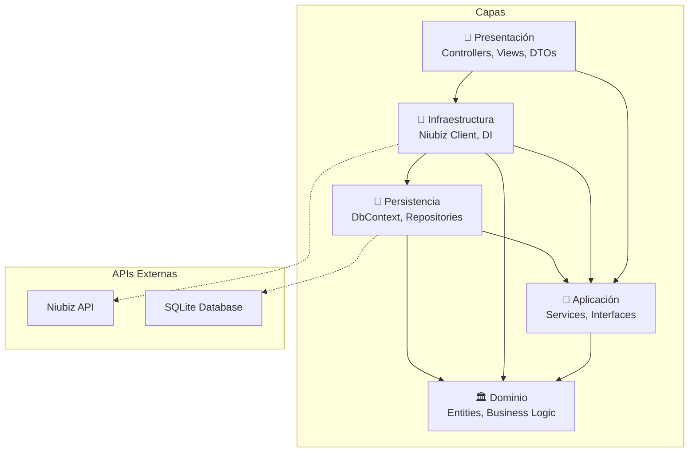
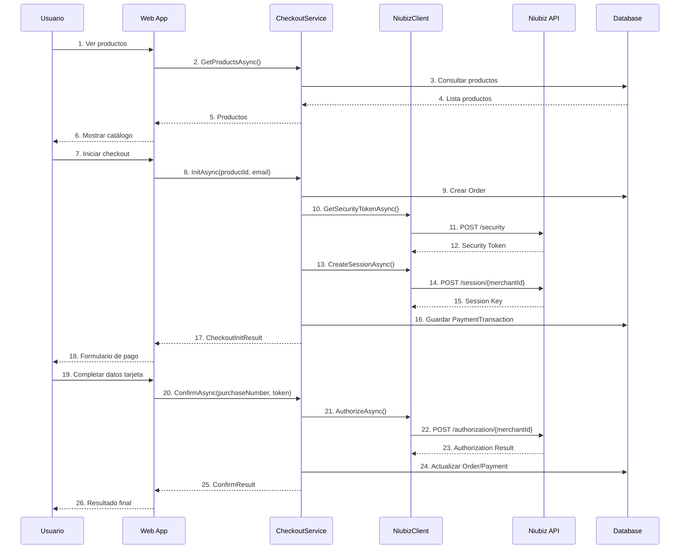

# Integración Niubiz Demo

**Manual de Integración Completo para Desarrolladores Terceros**

## Índice

1. [Descripción General](#descripción-general)
2. [Arquitectura del Proyecto](#arquitectura-del-proyecto)
3. [Diagrama de Dependencias](#diagrama-de-dependencias)
4. [API Niubiz - Documentación Completa](#api-niubiz---documentación-completa)
5. [Configuración y Variables de Entorno](#configuración-y-variables-de-entorno)
6. [Instalación y Ejecución](#instalación-y-ejecución)
7. [Endpoints y Funcionalidades](#endpoints-y-funcionalidades)
8. [Flujo de Pagos](#flujo-de-pagos)
9. [Ejemplos de Uso](#ejemplos-de-uso)
10. [Guía para Desarrolladores Terceros](#guía-para-desarrolladores-terceros)
11. [Estructura de Datos](#estructura-de-datos)
12. [Manejo de Errores](#manejo-de-errores)
13. [Seguridad](#seguridad)

---

## Descripción General

**IntegracionNiubizDemo** es una aplicación web desarrollada en **.NET 8.0** que demuestra la integración completa con la **API de pagos de Niubiz (VisaNet)**. La aplicación implementa un **sistema de e-commerce** con funcionalidades de catálogo de productos y procesamiento de pagos seguro.

### Características Principales

- ✅ **Arquitectura Clean Architecture** con separación clara de responsabilidades
- ✅ **Integración completa con Niubiz API** para procesamiento de pagos
- ✅ **Interfaz web responsiva** para gestión de productos y checkout
- ✅ **Base de datos SQLite** para persistencia de datos
- ✅ **Manejo de transacciones** con seguimiento completo del estado
- ✅ **Sistema de configuración flexible** para múltiples ambientes (QA/Producción)

### Tecnologías Utilizadas

- **Framework**: .NET 8.0 (ASP.NET Core MVC)
- **Base de Datos**: SQLite con Entity Framework Core 8.0
- **Frontend**: HTML5, CSS3, JavaScript (Bootstrap 5)
- **Patrones de Diseño**: Clean Architecture, Repository Pattern, Dependency Injection
- **API Externa**: Niubiz Payment Gateway API

---

## Arquitectura del Proyecto

El proyecto sigue los principios de **Clean Architecture** con una clara separación en capas:

```
IntegracionNiubizDemo/
├── 📁 IntegracionNiubizDemo.Domain/          # Capa de Dominio
│   └── Entities/                             # Entidades del negocio
│       ├── Product.cs                        # Producto
│       ├── Order.cs                          # Orden de compra
│       └── PaymentTransaction.cs             # Transacción de pago
│
├── 📁 IntegracionNiubizDemo.Application/     # Capa de Aplicación
│   ├── Abstractions/                         # Interfaces y contratos
│   │   ├── IProductService.cs                # Servicio de productos
│   │   ├── ICheckoutService.cs               # Servicio de checkout
│   │   ├── INiubizGateway.cs                 # Gateway de Niubiz
│   │   ├── IProductRepository.cs             # Repositorio de productos
│   │   ├── IOrderRepository.cs               # Repositorio de órdenes
│   │   └── IPaymentRepository.cs             # Repositorio de pagos
│   ├── Services/                             # Servicios de aplicación
│   │   ├── ProductService.cs                 # Lógica de productos
│   │   └── CheckoutService.cs                # Lógica de checkout
│   ├── Dtos/                                 # Objetos de transferencia
│   │   └── CheckoutDtos.cs                   # DTOs de checkout
│   └── DependencyInjection.cs               # Configuración DI
│
├── 📁 IntegracionNiubizDemo.Persistence/    # Capa de Persistencia
│   ├── Data/
│   │   └── AppDbContext.cs                   # Contexto de EF Core
│   └── Repositories/                         # Implementación de repositorios
│       ├── ProductRepository.cs              # Repositorio de productos
│       ├── OrderRepository.cs                # Repositorio de órdenes
│       └── PaymentRepository.cs              # Repositorio de pagos
│
├── 📁 IntegracionNiubizDemo.Infrastructure/ # Capa de Infraestructura
│   ├── Niubiz/                              # Integración con Niubiz
│   │   ├── NiubizClient.cs                  # Cliente HTTP para Niubiz
│   │   └── NiubizOptions.cs                 # Configuración de Niubiz
│   └── DependencyInjection.cs              # Configuración DI
│
└── 📁 IntegracionNiubizDemo.Web/            # Capa de Presentación
    ├── Controllers/                          # Controladores MVC
    │   ├── ProductsController.cs             # Gestión de productos
    │   ├── CheckoutController.cs             # Proceso de checkout
    │   └── HomeController.cs                 # Página principal
    ├── Views/                                # Vistas Razor
    │   ├── Products/                         # Vistas de productos
    │   ├── Checkout/                         # Vistas de checkout
    │   └── Shared/                           # Vistas compartidas
    ├── appsettings.json                      # Configuración base
    ├── appsettings.Development.json          # Configuración desarrollo
    └── Program.cs                            # Punto de entrada
```

### Principios Aplicados

1. **Separación de Responsabilidades**: Cada capa tiene una responsabilidad específica
2. **Inversión de Dependencias**: Las capas externas dependen de las internas mediante interfaces
3. **Independencia de Frameworks**: La lógica de negocio no depende de frameworks externos
4. **Testabilidad**: Arquitectura preparada para pruebas unitarias e integración

---

## Diagrama de Dependencias



### Dependencias de Paquetes NuGet

**Capa Application:**
- `Microsoft.Extensions.DependencyInjection` (9.0.8)
- `Microsoft.Extensions.Configuration.Abstractions` (9.0.8)

**Capa Infrastructure:**
- `Microsoft.EntityFrameworkCore` (9.0.8)
- `Microsoft.EntityFrameworkCore.Sqlite` (9.0.8)
- `Microsoft.EntityFrameworkCore.InMemory` (9.0.8)
- `Microsoft.Extensions.Http` (9.0.8)
- `Microsoft.Extensions.Logging.Abstractions` (9.0.8)
- `Microsoft.Extensions.Options` (9.0.8)
- `Microsoft.Extensions.Configuration.Abstractions` (9.0.8)

**Capa Persistence:**
- `Microsoft.EntityFrameworkCore` (9.0.8)
- `Microsoft.EntityFrameworkCore.Design` (9.0.8)

---

## API Niubiz - Documentación Completa

### Descripción de la API

**Niubiz** (anteriormente VisaNet) es la plataforma de pagos electrónicos líder en Perú. La integración se realiza mediante una API REST que sigue un flujo de 3 pasos:

1. **Obtener Security Token** - Autenticación inicial
2. **Crear Session** - Inicializar transacción
3. **Autorizar Pago** - Procesar la transacción

### URLs Base por Ambiente

| Ambiente | URL Base | Descripción |
|----------|----------|-------------|
| **QA/Testing** | `https://apitestenv.vnforapps.com` | Ambiente de pruebas |
| **Producción** | `https://apiprod.vnforapps.com` | Ambiente productivo |

### Endpoints de la API

#### 1. Security Token Endpoint

**Propósito**: Obtener token de seguridad para autenticación

```http
POST /api.security/v1/security
Authorization: Basic {base64(username:password)}
Content-Type: text/plain
```

**Respuesta**:
```json
"eyJhbGciOiJIUzI1NiIsInR5cCI6IkpXVCJ9..."
```

#### 2. Session Endpoint

**Propósito**: Crear sesión de pago e inicializar transacción

```http
POST /api.ecommerce/v2/ecommerce/token/session/{merchantId}
Authorization: {securityToken}
Content-Type: application/json
```

**Cuerpo de la Petición**:
```json
{
  "channel": "web",
  "amount": "150.00",
  "antifraud": {
    "clientIp": "127.0.0.1",
    "merchantDefineData": {
      "MDD4": "cliente@email.com",
      "MDD30": "40904759",
      "MDD31": "986687645",
      "MDD32": "40904759",
      "MDD33": "25",
      "MDD34": "40904759",
      "MDD63": "25",
      "MDD65": "40904759",
      "MDD71": "700526895"
    }
  }
}
```

**Respuesta**:
```json
{
  "sessionKey": "b25b9b7c-4a83-4a5e-8b5c-9d7e8f9g0h1i",
  "expirationTime": 1200,
  "merchantId": "400000181"
}
```

#### 3. Authorization Endpoint

**Propósito**: Autorizar el pago con los datos de la tarjeta

```http
POST /api.authorization/v3/authorization/ecommerce/{merchantId}
Authorization: {securityToken}
Content-Type: application/json
```

**Cuerpo de la Petición**:
```json
{
  "channel": "web",
  "captureType": "automatic",
  "countable": true,
  "order": {
    "tokenId": "{transactionToken}",
    "purchaseNumber": "PUR12345",
    "amount": 150.00,
    "currency": "PEN"
  }
}
```

**Respuesta Exitosa**:
```json
{
  "order": {
    "actionCode": "000",
    "authorizationCode": "123456",
    "purchaseNumber": "PUR12345",
    "amount": 150.00,
    "currency": "PEN"
  },
  "dataMap": {
    "CARD": "**** **** **** 1234",
    "BRAND": "visa"
  }
}
```

### Configuración de Niubiz

La integración requiere las siguientes credenciales:

```json
{
  "Niubiz": {
    "Environment": "qa",           // "qa" | "prod"
    "MerchantId": "400000181",     // ID del comercio
    "Username": "usuario@merchant.com",
    "Password": "password123",
    "Currency": "PEN",             // Moneda (PEN/USD)
    "BaseUrls": {
      "qa": "https://apitestenv.vnforapps.com",
      "prod": "https://apiprod.vnforapps.com"
    },
    "StaticContent": {
      "qa": "https://static-content-qas.vnforapps.com/v2/js/checkout.js?qa=true",
      "prod": "https://static-content.vnforapps.com/v2/js/checkout.js"
    },
    "Endpoints": {
      "Security": "/api.security/v1/security",
      "Session": "/api.ecommerce/v2/ecommerce/token/session/{merchantId}",
      "Authorization": "/api.authorization/v3/authorization/ecommerce/{merchantId}"
    }
  }
}
```

### Implementación en el Proyecto

La integración está encapsulada en la clase `NiubizClient`:

```csharp
public class NiubizClient : INiubizGateway
{
    public async Task<string> GetSecurityTokenAsync(CancellationToken ct = default);
    public async Task<string> CreateSessionAsync(string securityToken, decimal amount, 
        string purchaseNumber, string currency, CancellationToken ct = default);
    public async Task<AuthorizationResult> AuthorizeAsync(string securityToken, 
        string transactionToken, decimal amount, string currency, 
        string purchaseNumber, CancellationToken ct = default);
}
```

---

## Configuración y Variables de Entorno

### Configuración Base (appsettings.json)

```json
{
  "Logging": {
    "LogLevel": {
      "Default": "Information",
      "Microsoft.AspNetCore": "Warning"
    }
  },
  "AllowedHosts": "*"
}
```

### Configuración de Desarrollo (appsettings.Development.json)

```json
{
  "Logging": {
    "LogLevel": {
      "Default": "Information",
      "Microsoft.AspNetCore": "Warning"
    }
  },
  "Niubiz": {
    "Environment": "qa",
    "MerchantId": "400000181",
    "Username": "integraciones.visanet@necomplus.com",
    "Password": "d5e7nk$M",
    "Currency": "PEN",
    "BaseUrls": {
      "qa": "https://apitestenv.vnforapps.com",
      "prod": "https://apiprod.vnforapps.com"
    },
    "StaticContent": {
      "qa": "https://static-content-qas.vnforapps.com/v2/js/checkout.js?qa=true",
      "prod": "https://static-content.vnforapps.com/v2/js/checkout.js"
    },
    "Endpoints": {
      "Security": "/api.security/v1/security",
      "Session": "/api.ecommerce/v2/ecommerce/token/session/{merchantId}",
      "Authorization": "/api.authorization/v3/authorization/ecommerce/{merchantId}"
    }
  },
  "ConnectionStrings": {
    "Default": "Data Source=app.db"
  }
}
```

### Variables de Entorno de Producción

Para producción, configure las siguientes variables de entorno:

```bash
# Configuración Niubiz
NIUBIZ__ENVIRONMENT=prod
NIUBIZ__MERCHANTID=su_merchant_id_produccion
NIUBIZ__USERNAME=su_usuario_produccion
NIUBIZ__PASSWORD=su_password_produccion

# Base de datos
CONNECTIONSTRINGS__DEFAULT="Data Source=production.db"

# Logging
LOGGING__LOGLEVEL__DEFAULT=Warning
```

### User Secrets para Desarrollo

Para mayor seguridad en desarrollo, use User Secrets:

```bash
dotnet user-secrets init --project IntegracionNiubizDemo.Web
dotnet user-secrets set "Niubiz:MerchantId" "su_merchant_id" --project IntegracionNiubizDemo.Web
dotnet user-secrets set "Niubiz:Username" "su_usuario" --project IntegracionNiubizDemo.Web
dotnet user-secrets set "Niubiz:Password" "su_password" --project IntegracionNiubizDemo.Web
```

---

## Instalación y Ejecución

### Requisitos Previos

- **.NET 8.0 SDK** o superior
- **Git** para clonar el repositorio
- **IDE** recomendado: Visual Studio 2022 o Visual Studio Code
- **Navegador web** moderno

### Pasos de Instalación

1. **Clonar el repositorio**:
```bash
git clone https://github.com/eincioch/IntegracionNiubizDemo.git
cd IntegracionNiubizDemo
```

2. **Restaurar paquetes NuGet**:
```bash
dotnet restore
```

3. **Compilar la solución**:
```bash
dotnet build
```

4. **Configurar credenciales de Niubiz**:
   - Editar `IntegracionNiubizDemo.Web/appsettings.Development.json`
   - O configurar User Secrets (recomendado)

5. **Ejecutar la aplicación**:
```bash
cd IntegracionNiubizDemo.Web
dotnet run
```

6. **Abrir en el navegador**:
   - URL: `https://localhost:5001` o `http://localhost:5000`

### Scripts Útiles

**Compilar y ejecutar**:
```bash
dotnet build && cd IntegracionNiubizDemo.Web && dotnet run
```

**Limpiar y recompilar**:
```bash
dotnet clean && dotnet build
```

**Ejecutar en modo desarrollo con watch**:
```bash
cd IntegracionNiubizDemo.Web
dotnet watch run
```

---

## Endpoints y Funcionalidades

### Endpoints Públicos

| Método | Ruta | Descripción | Parámetros |
|--------|------|-------------|------------|
| `GET` | `/` | Página principal | - |
| `GET` | `/Products` | Lista de productos | - |
| `GET` | `/Products/Details/{id}` | Detalle de producto | `id: Guid` |
| `GET` | `/checkout/pay/{productId}` | Iniciar checkout | `productId: Guid`, `email?: string` |
| `POST` | `/checkout/confirm` | Confirmar pago | `purchaseNumber, transactionToken` |

### API Controllers

#### ProductsController

**Funcionalidades**:
- Listar productos disponibles
- Ver detalles de producto individual
- Navegación hacia proceso de checkout

**Métodos**:
```csharp
public async Task<IActionResult> Index()           // Lista productos
public async Task<IActionResult> Details(Guid id) // Detalle producto
```

#### CheckoutController

**Funcionalidades**:
- Inicializar proceso de pago
- Confirmar transacción con Niubiz
- Manejo de respuestas y errores

**Métodos**:
```csharp
[HttpGet("/checkout/pay/{productId:guid}")]
public async Task<IActionResult> Pay(Guid productId, string? email = null)

[HttpPost("/checkout/confirm")]
public async Task<IActionResult> Confirm(
    [FromForm] string? purchaseNumber,
    [FromForm] string? transactionToken)
```

### Servicios de Aplicación

#### ICheckoutService

```csharp
public interface ICheckoutService
{
    Task<CheckoutInitResult> InitAsync(Guid productId, string? customerEmail, CancellationToken ct = default);
    Task<ConfirmResult> ConfirmAsync(string purchaseNumber, string transactionToken, CancellationToken ct = default);
}
```

#### IProductService

```csharp
public interface IProductService
{
    Task<IReadOnlyList<Product>> GetProductsAsync(CancellationToken ct = default);
    Task EnsureSeedDataAsync(CancellationToken ct = default);
}
```

---

## Flujo de Pagos

### Diagrama de Flujo Completo



### Descripción Detallada del Flujo

#### Fase 1: Inicialización del Checkout

1. **Usuario selecciona producto**: Navega desde el catálogo
2. **Validación de producto**: Verificar existencia y precio
3. **Creación de orden**: Generar número de compra único
4. **Obtención de Security Token**: Autenticación con Niubiz
5. **Creación de sesión**: Inicializar transacción en Niubiz
6. **Persistencia**: Guardar estado en base de datos

#### Fase 2: Captura de Datos de Pago

7. **Formulario de pago**: Cargar JavaScript de Niubiz
8. **Tokenización**: Niubiz tokeniza datos de tarjeta
9. **Validación**: Verificar datos en el frontend

#### Fase 3: Autorización y Confirmación

10. **Envío de token**: Submit del formulario con token
11. **Autorización**: Procesar pago en Niubiz
12. **Actualización de estado**: Marcar orden como pagada/rechazada
13. **Respuesta al usuario**: Mostrar resultado final

### Estados de Orden

```csharp
public enum OrderStatus 
{ 
    Pending = 0,    // Orden creada, esperando pago
    Paid = 1,       // Pago autorizado exitosamente
    Rejected = 2,   // Pago rechazado
    Error = 3       // Error en el proceso
}
```

---

## Ejemplos de Uso

### Ejemplo 1: Consultar Productos

**Request**:
```http
GET /Products
Accept: text/html
```

**Response**: Página HTML con lista de productos

### Ejemplo 2: Iniciar Checkout

**Request**:
```http
GET /checkout/pay/550e8400-e29b-41d4-a716-446655440000?email=cliente@email.com
```

**Response**: Formulario de pago con JavaScript de Niubiz

### Ejemplo 3: Confirmar Pago

**Request**:
```http
POST /checkout/confirm
Content-Type: application/x-www-form-urlencoded

purchaseNumber=PUR123456789&transactionToken=abc123def456
```

**Response**: Página de confirmación con resultado

### Ejemplo 4: Integración vía API (Para Terceros)

Si desea integrar con otra aplicación, puede usar los servicios directamente:

```csharp
// Inyectar dependencias
public class MiControlador
{
    private readonly ICheckoutService _checkout;
    
    public MiControlador(ICheckoutService checkout)
    {
        _checkout = checkout;
    }
    
    // Inicializar pago
    public async Task<ActionResult> IniciarPago(Guid productId)
    {
        var result = await _checkout.InitAsync(productId, "cliente@email.com");
        
        return Json(new {
            sessionKey = result.SessionKey,
            merchantId = result.MerchantId,
            purchaseNumber = result.PurchaseNumber,
            amount = result.Amount,
            currency = result.Currency,
            jsUrl = result.StaticJsUrl
        });
    }
    
    // Confirmar pago
    public async Task<ActionResult> ConfirmarPago(string purchaseNumber, string transactionToken)
    {
        var result = await _checkout.ConfirmAsync(purchaseNumber, transactionToken);
        
        return Json(new {
            success = result.Success,
            authorizationCode = result.AuthorizationCode,
            message = result.Message
        });
    }
}
```

---

## Guía para Desarrolladores Terceros

### Integración Básica

#### Paso 1: Configurar Dependencias

Agregue el servicio a su aplicación:

```csharp
// En Program.cs o Startup.cs
builder.Services.AddApplication();
builder.Services.AddInfrastructure(builder.Configuration);
```

#### Paso 2: Configurar Niubiz

```json
{
  "Niubiz": {
    "Environment": "qa",
    "MerchantId": "SU_MERCHANT_ID",
    "Username": "SU_USUARIO",
    "Password": "SU_PASSWORD",
    "Currency": "PEN"
  }
}
```

#### Paso 3: Implementar Controller

```csharp
[ApiController]
[Route("api/[controller]")]
public class PagosController : ControllerBase
{
    private readonly ICheckoutService _checkout;
    
    public PagosController(ICheckoutService checkout)
    {
        _checkout = checkout;
    }
    
    [HttpPost("iniciar")]
    public async Task<IActionResult> IniciarPago([FromBody] IniciarPagoRequest request)
    {
        try
        {
            var result = await _checkout.InitAsync(request.ProductId, request.Email);
            return Ok(result);
        }
        catch (Exception ex)
        {
            return BadRequest(new { error = ex.Message });
        }
    }
    
    [HttpPost("confirmar")]
    public async Task<IActionResult> ConfirmarPago([FromBody] ConfirmarPagoRequest request)
    {
        try
        {
            var result = await _checkout.ConfirmAsync(request.PurchaseNumber, request.TransactionToken);
            return Ok(result);
        }
        catch (Exception ex)
        {
            return BadRequest(new { error = ex.Message });
        }
    }
}

public record IniciarPagoRequest(Guid ProductId, string? Email);
public record ConfirmarPagoRequest(string PurchaseNumber, string TransactionToken);
```

### Integración Avanzada

#### Personalizar Repositorios

```csharp
public class MiProductRepository : IProductRepository
{
    // Implementar interfaz con su lógica personalizada
    public async Task<Product?> GetByIdAsync(Guid id, CancellationToken ct = default)
    {
        // Su implementación personalizada
    }
}

// Registrar en DI
builder.Services.AddScoped<IProductRepository, MiProductRepository>();
```

#### Extender Servicios

```csharp
public class MiCheckoutService : ICheckoutService
{
    private readonly CheckoutService _baseService;
    
    public MiCheckoutService(CheckoutService baseService)
    {
        _baseService = baseService;
    }
    
    public async Task<CheckoutInitResult> InitAsync(Guid productId, string? customerEmail, CancellationToken ct = default)
    {
        // Lógica personalizada antes
        var result = await _baseService.InitAsync(productId, customerEmail, ct);
        // Lógica personalizada después
        return result;
    }
}
```

#### Frontend JavaScript

Para implementar el frontend, use el JavaScript de Niubiz:

```html
<!DOCTYPE html>
<html>
<head>
    <title>Checkout</title>
</head>
<body>
    <form id="payment-form" action="/api/pagos/confirmar" method="post">
        <input type="hidden" name="purchaseNumber" value="PUR123456" />
        <input type="hidden" id="transactionToken" name="transactionToken" />
    </form>

    <script type="text/javascript" 
            src="https://static-content-qas.vnforapps.com/v2/js/checkout.js?qa=true"
            data-sessiontoken="session_key_from_backend"
            data-channel="web"
            data-merchantid="400000181"
            data-purchasenumber="PUR123456"
            data-amount="150.00"
            data-currency="PEN"
            data-expirationminutes="20"
            data-timeouturl="about:blank">
    </script>

    <script>
        function culqiSuccessCallback(token) {
            document.getElementById('transactionToken').value = token.token;
            document.getElementById('payment-form').submit();
        }
    </script>
</body>
</html>
```

---

## Estructura de Datos

### Entidades del Dominio

#### Product

```csharp
public class Product
{
    public Guid Id { get; set; }          // Identificador único
    public string Name { get; set; }      // Nombre del producto
    public decimal Price { get; set; }    // Precio en la moneda configurada
}
```

#### Order

```csharp
public class Order
{
    public Guid Id { get; set; }                    // Identificador único
    public string PurchaseNumber { get; set; }      // Número de compra único
    public decimal Amount { get; set; }             // Monto total
    public string Currency { get; set; }            // Moneda (PEN/USD)
    public DateTimeOffset CreatedAt { get; set; }   // Fecha de creación
    public OrderStatus Status { get; set; }         // Estado de la orden
    public string? CustomerEmail { get; set; }      // Email del cliente
}
```

#### PaymentTransaction

```csharp
public class PaymentTransaction
{
    public Guid Id { get; set; }                    // Identificador único
    public Guid OrderId { get; set; }               // Referencia a la orden
    public string? SessionKey { get; set; }         // Clave de sesión de Niubiz
    public string? TransactionToken { get; set; }   // Token de transacción
    public string? AuthorizationCode { get; set; }  // Código de autorización
    public string? MaskedCard { get; set; }         // Tarjeta enmascarada
    public string Status { get; set; }              // Estado de la transacción
    public string? RawResponse { get; set; }        // Respuesta cruda de Niubiz
    public DateTimeOffset CreatedAt { get; set; }   // Fecha de creación
}
```

### DTOs de Transferencia

#### CheckoutInitResult

```csharp
public record CheckoutInitResult(
    string MerchantId,        // ID del comercio
    string SessionKey,        // Clave de sesión para el frontend
    string PurchaseNumber,    // Número de compra generado
    decimal Amount,           // Monto a cobrar
    string Currency,          // Moneda
    string StaticJsUrl        // URL del JavaScript de Niubiz
);
```

#### AuthorizationResult

```csharp
public record AuthorizationResult(
    bool Approved,            // Indica si fue aprobado
    string? AuthorizationCode, // Código de autorización
    string? MaskedCard,       // Tarjeta enmascarada
    string RawJson            // Respuesta completa de Niubiz
);
```

#### ConfirmResult

```csharp
public record ConfirmResult(
    bool Success,             // Indica si fue exitoso
    string PurchaseNumber,    // Número de compra
    string? AuthorizationCode, // Código de autorización
    string Message,           // Mensaje para el usuario
    string? MaskedCard,       // Tarjeta enmascarada
    string RawJson            // Respuesta completa
);
```

### Configuración de Base de Datos

Entity Framework está configurado con las siguientes relaciones:

```csharp
protected override void OnModelCreating(ModelBuilder modelBuilder)
{
    // Producto
    modelBuilder.Entity<Product>(b =>
    {
        b.HasKey(p => p.Id);
        b.Property(p => p.Name).IsRequired().HasMaxLength(200);
        b.Property(p => p.Price).HasPrecision(18, 2);
    });

    // Orden
    modelBuilder.Entity<Order>(b =>
    {
        b.HasKey(o => o.Id);
        b.Property(o => o.PurchaseNumber).IsRequired().HasMaxLength(20);
        b.HasIndex(o => o.PurchaseNumber).IsUnique();
        b.Property(o => o.Amount).HasPrecision(18, 2);
        b.Property(o => o.Currency).IsRequired().HasMaxLength(3);
        b.Property(o => o.Status).HasConversion<int>();
        b.Property(o => o.CustomerEmail).HasMaxLength(256);
    });

    // Transacción de Pago
    modelBuilder.Entity<PaymentTransaction>(b =>
    {
        b.HasKey(t => t.Id);
        b.Property(t => t.SessionKey).HasMaxLength(256);
        b.Property(t => t.TransactionToken).HasMaxLength(256);
        b.Property(t => t.AuthorizationCode).HasMaxLength(64);
        b.Property(t => t.MaskedCard).HasMaxLength(32);
        b.Property(t => t.Status).HasMaxLength(32);
        
        b.HasIndex(t => t.OrderId);
        b.HasOne<Order>()
         .WithMany()
         .HasForeignKey(t => t.OrderId)
         .OnDelete(DeleteBehavior.Cascade);
    });
}
```

---

## Manejo de Errores

### Estrategia de Manejo de Errores

La aplicación implementa múltiples capas de manejo de errores:

#### 1. Validación de Entrada

```csharp
public async Task<CheckoutInitResult> InitAsync(Guid productId, string? customerEmail, CancellationToken ct = default)
{
    var product = await _products.GetByIdAsync(productId, ct);
    if (product is null) 
        throw new KeyNotFoundException("Producto no encontrado");
    
    // Continuar con la lógica...
}
```

#### 2. Errores de Integración con Niubiz

```csharp
public async Task<string> GetSecurityTokenAsync(CancellationToken ct = default)
{
    try
    {
        using var res = await _http.SendAsync(req, ct);
        var body = await res.Content.ReadAsStringAsync(ct);

        if (!res.IsSuccessStatusCode)
            throw new InvalidOperationException($"No se pudo obtener el security token (HTTP {(int)res.StatusCode}): {body}");

        return body.Trim().Trim('"');
    }
    catch (HttpRequestException ex)
    {
        throw new InvalidOperationException("Error de conectividad con Niubiz", ex);
    }
}
```

#### 3. Errores en Controladores

```csharp
[HttpGet("/checkout/pay/{productId:guid}")]
public async Task<IActionResult> Pay(Guid productId, string? email = null, CancellationToken ct = default)
{
    try
    {
        var init = await _checkout.InitAsync(productId, email, ct);
        return View("Pay", init);
    }
    catch (KeyNotFoundException)
    {
        TempData["PaymentMessage"] = "Producto no encontrado. Refresca la lista e inténtalo otra vez.";
        return RedirectToAction("Index", "Products");
    }
    catch (InvalidOperationException ex)
    {
        TempData["PaymentMessage"] = $"Error en la integración: {ex.Message}";
        return RedirectToAction("Index", "Products");
    }
}
```

### Códigos de Error Comunes

#### Niubiz API

| Código | Descripción | Acción Recomendada |
|--------|-------------|-------------------|
| `000` | Transacción aprobada | Continuar con el flujo |
| `100` | Transacción rechazada | Mostrar mensaje al usuario |
| `101` | Tarjeta vencida | Solicitar otra tarjeta |
| `102` | Tarjeta restringida | Contactar al banco |
| `200` | Monto no disponible | Verificar límite de tarjeta |
| `201` | Fecha de expiración incorrecta | Verificar datos de tarjeta |
| `202` | Código de seguridad incorrecto | Verificar CVV |

#### Errores de Aplicación

```csharp
public class ErrorCodes
{
    public const string PRODUCT_NOT_FOUND = "PRODUCT_NOT_FOUND";
    public const string INVALID_AMOUNT = "INVALID_AMOUNT";
    public const string NIUBIZ_CONNECTION_ERROR = "NIUBIZ_CONNECTION_ERROR";
    public const string INVALID_TRANSACTION_TOKEN = "INVALID_TRANSACTION_TOKEN";
    public const string ORDER_ALREADY_PROCESSED = "ORDER_ALREADY_PROCESSED";
}
```

### Logging

La aplicación utiliza el sistema de logging de .NET:

```csharp
public class NiubizClient : INiubizGateway
{
    private readonly ILogger<NiubizClient> _logger;

    public async Task<string> GetSecurityTokenAsync(CancellationToken ct = default)
    {
        _logger.LogInformation("Solicitando security token a Niubiz");
        
        try
        {
            // Lógica...
            _logger.LogInformation("Security token obtenido exitosamente");
            return token;
        }
        catch (Exception ex)
        {
            _logger.LogError(ex, "Error al obtener security token de Niubiz");
            throw;
        }
    }
}
```

---

## Seguridad

### Medidas de Seguridad Implementadas

#### 1. Protección de Credenciales

- **User Secrets**: Para desarrollo local
- **Variables de Entorno**: Para producción
- **Configuración Separada**: Credenciales fuera del código fuente

#### 2. HTTPS Obligatorio

```csharp
// En Program.cs
if (!app.Environment.IsDevelopment())
{
    app.UseHsts();
}
app.UseHttpsRedirection();
```

#### 3. Validación Anti-Forgery

```html
<!-- En formularios -->
@Html.AntiForgeryToken()
```

```csharp
[HttpPost("/checkout/confirm")]
[ValidateAntiForgeryToken] // Habilitado cuando sea necesario
public async Task<IActionResult> Confirm(...)
```

#### 4. Cookies Seguras

```csharp
Response.Cookies.Append("LastPurchaseNumber", purchaseNumber, new CookieOptions
{
    HttpOnly = true,      // No accesible desde JavaScript
    Secure = true,        // Solo HTTPS
    SameSite = SameSiteMode.Lax,
    Expires = DateTimeOffset.UtcNow.AddMinutes(30)
});
```

#### 5. Sanitización de Datos

```csharp
// Validación de entrada
if (string.IsNullOrWhiteSpace(purchaseNumber) || purchaseNumber.Length > 20)
{
    return BadRequest("Número de compra inválido");
}

// Escape de HTML en vistas
@Html.Raw(Html.Encode(Model.Message))
```

### Recomendaciones de Seguridad para Producción

#### 1. Configuración de Headers de Seguridad

```csharp
app.Use((context, next) =>
{
    context.Response.Headers.Add("X-Frame-Options", "DENY");
    context.Response.Headers.Add("X-Content-Type-Options", "nosniff");
    context.Response.Headers.Add("X-XSS-Protection", "1; mode=block");
    context.Response.Headers.Add("Referrer-Policy", "strict-origin-when-cross-origin");
    return next();
});
```

#### 2. Rate Limiting

```csharp
// Instalar: AspNetCoreRateLimit
builder.Services.AddMemoryCache();
builder.Services.Configure<IpRateLimitOptions>(builder.Configuration.GetSection("IpRateLimiting"));
builder.Services.AddSingleton<IIpPolicyStore, MemoryCacheIpPolicyStore>();
builder.Services.AddSingleton<IRateLimitCounterStore, MemoryCacheRateLimitCounterStore>();
```

#### 3. Monitoreo y Auditoría

```csharp
_logger.LogWarning("Intento de pago con orden ya procesada: {PurchaseNumber}", purchaseNumber);
_logger.LogInformation("Pago exitoso - Orden: {PurchaseNumber}, Auth: {AuthCode}", 
    order.PurchaseNumber, result.AuthorizationCode);
```

#### 4. Validación de SSL/TLS

- Verificar certificados SSL válidos
- Usar TLS 1.2 o superior
- Implementar Certificate Pinning si es crítico

#### 5. Backup y Recuperación

```bash
# Backup de base de datos
cp app.db app.db.backup.$(date +%Y%m%d_%H%M%S)

# Rotación de logs
logrotate -f /etc/logrotate.d/integracion-niubiz
```

---

## Información Adicional

### Contacto y Soporte

- **Desarrollador**: Enrique Incio
- **Email**: enrique.incio@gmail.com
- **Repositorio**: https://github.com/eincioch/IntegracionNiubizDemo

### Documentación de Niubiz

- **Portal Desarrolladores**: https://desarrolladores.niubiz.com.pe/
- **API Reference**: https://desarrolladores.niubiz.com.pe/api/
- **Soporte Técnico**: soporte@niubiz.com.pe

### Contribuciones

Las contribuciones son bienvenidas. Por favor:

1. Fork el repositorio
2. Crear una rama para su feature (`git checkout -b feature/AmazingFeature`)
3. Commit sus cambios (`git commit -m 'Add some AmazingFeature'`)
4. Push a la rama (`git push origin feature/AmazingFeature`)
5. Abrir un Pull Request

### Licencia

Este proyecto está bajo la licencia MIT. Ver el archivo `LICENSE` para más detalles.

### Changelog

#### v1.0.0 (2024-01-XX)
- Implementación inicial de integración con Niubiz
- Clean Architecture con .NET 8.0
- Funcionalidades básicas de e-commerce
- Documentación completa

---

**¡Gracias por usar IntegracionNiubizDemo!**

Este proyecto demuestra las mejores prácticas para integrar con la API de Niubiz y puede servir como base para implementaciones reales en producción.