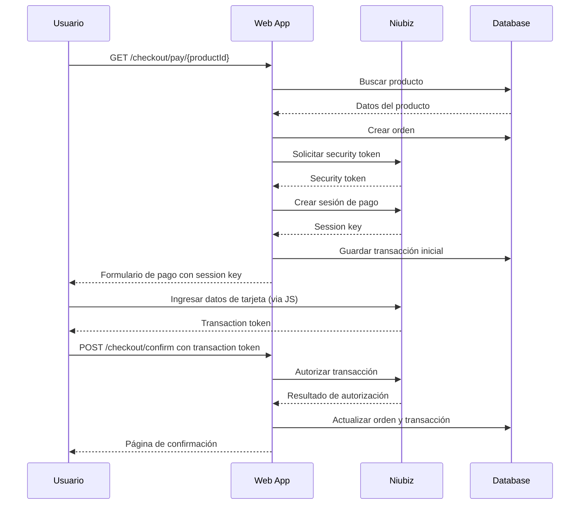

# 📋 API Documentation

## Overview

Esta documentación describe los endpoints disponibles en la aplicación **IntegracionNiubizDemo** y cómo interactuar con ellos.

## Base URL

- **Desarrollo**: `https://localhost:5001` o `http://localhost:5000`
- **Producción**: Tu dominio configurado

## Authentication

La aplicación no requiere autenticación de usuario para los endpoints públicos, pero utiliza autenticación básica para comunicarse con Niubiz internamente.

## Endpoints

### 🛍️ Products

#### GET `/` 
**Descripción**: Página principal que muestra el catálogo de productos  
**Método**: `GET`  
**Parámetros**: Ninguno  
**Respuesta**: Renderiza la vista con lista de productos  

**Ejemplo de uso**:
```http
GET / HTTP/1.1
Host: localhost:5001
```

#### GET `/Products`
**Descripción**: Lista todos los productos disponibles  
**Método**: `GET`  
**Parámetros**: Ninguno  
**Respuesta**: Renderiza la vista Products/Index con lista de productos  

**Ejemplo de uso**:
```http
GET /Products HTTP/1.1
Host: localhost:5001
```

**Respuesta HTML**: Tabla con productos mostrando:
- Nombre del producto
- Precio en formato moneda
- Botón "Comprar" que redirige al checkout

### 💳 Checkout

#### GET `/checkout/pay/{productId}`
**Descripción**: Inicia el proceso de pago para un producto específico  
**Método**: `GET`  
**Parámetros**:
- `productId` (path, required): GUID del producto a comprar
- `email` (query, optional): Email del cliente

**Ejemplo de uso**:
```http
GET /checkout/pay/123e4567-e89b-12d3-a456-426614174000?email=customer@example.com HTTP/1.1
Host: localhost:5001
```

**Respuesta exitosa**: Renderiza vista Pay.cshtml con:
```html
<!-- Formulario de pago con integración Niubiz -->
<script>
window.VisanetCheckout = {
    settings: {
        merchantId: '522591303',
        sessionKey: 'session-key-from-niubiz',
        amount: '99.99',
        currency: 'PEN',
        purchaseNumber: 'PUR-20231201-001'
    }
};
</script>
```

**Respuesta de error**: Redirección a `/Products` con mensaje de error en TempData

**Códigos de estado**:
- `200 OK`: Producto encontrado, formulario de pago mostrado
- `302 Found`: Producto no encontrado, redirección con error

#### POST `/checkout/confirm`
**Descripción**: Confirma y procesa el pago con el token recibido de Niubiz  
**Método**: `POST`  
**Content-Type**: `application/x-www-form-urlencoded`  

**Parámetros del formulario**:
- `purchaseNumber` (string, required): Número de compra generado
- `transactionToken` (string, required): Token de transacción de Niubiz
- `tokenId` (string, alternative): Token alternativo de Niubiz
- `token` (string, alternative): Token genérico de Niubiz

**Ejemplo de uso**:
```http
POST /checkout/confirm HTTP/1.1
Host: localhost:5001
Content-Type: application/x-www-form-urlencoded

purchaseNumber=PUR-20231201-001&transactionToken=eyJ0eXAiOiJKV1QiLCJhbGc...
```

**Respuesta exitosa** (200 OK):
```html
<!-- Vista Confirm.cshtml con resultado del pago -->
<div class="payment-result success">
    <h2>✅ Pago Exitoso</h2>
    <p><strong>Número de Compra:</strong> PUR-20231201-001</p>
    <p><strong>Código de Autorización:</strong> 123456</p>
    <p><strong>Tarjeta:</strong> ****1234</p>
</div>
```

**Respuesta de error** (200 OK con contenido de error):
```html
<!-- Vista Confirm.cshtml con error -->
<div class="payment-result error">
    <h2>❌ Pago Rechazado</h2>
    <p><strong>Motivo:</strong> Tarjeta sin fondos suficientes</p>
    <p><strong>Número de Compra:</strong> PUR-20231201-001</p>
</div>
```

### 🏠 Home

#### GET `/Home`
**Descripción**: Página de inicio alternativa  
**Método**: `GET`  
**Parámetros**: Ninguno  
**Respuesta**: Vista Home/Index  

#### GET `/Home/Privacy`
**Descripción**: Página de políticas de privacidad  
**Método**: `GET`  
**Parámetros**: Ninguno  
**Respuesta**: Vista Home/Privacy  

#### GET `/Home/Error`
**Descripción**: Página de error genérica  
**Método**: `GET`  
**Parámetros**: Ninguno  
**Respuesta**: Vista Home/Error con información del error  

## Data Models

### CheckoutInitResult
```csharp
public record CheckoutInitResult(
    string MerchantId,      // ID del comercio en Niubiz
    string SessionKey,      // Clave de sesión para el formulario
    string PurchaseNumber,  // Número único de compra
    decimal Amount,         // Monto a cobrar
    string Currency,        // Moneda (PEN, USD)
    string StaticJsUrl      // URL del JavaScript de Niubiz
);
```

### ConfirmResult
```csharp
public record ConfirmResult(
    bool Success,               // Indica si el pago fue exitoso
    string PurchaseNumber,      // Número de compra
    string? AuthorizationCode,  // Código de autorización (si exitoso)
    string Message,            // Mensaje descriptivo del resultado
    string? MaskedCard,        // Tarjeta enmascarada (****1234)
    string RawJson             // Respuesta completa de Niubiz
);
```

### Product
```csharp
public class Product
{
    public Guid Id { get; set; }        // Identificador único
    public string Name { get; set; }    // Nombre del producto
    public decimal Price { get; set; }  // Precio en la moneda configurada
}
```

### Order
```csharp
public class Order
{
    public Guid Id { get; set; }                    // Identificador único
    public string PurchaseNumber { get; set; }     // Número de compra único
    public decimal Amount { get; set; }            // Monto total
    public string Currency { get; set; }           // Moneda (PEN)
    public DateTimeOffset CreatedAt { get; set; }  // Fecha de creación
    public OrderStatus Status { get; set; }        // Estado de la orden
    public string? CustomerEmail { get; set; }     // Email del cliente
}

public enum OrderStatus 
{ 
    Pending = 0,    // Pendiente de pago
    Paid = 1,       // Pagada exitosamente
    Rejected = 2,   // Pago rechazado
    Error = 3       // Error en el proceso
}
```

### PaymentTransaction
```csharp
public class PaymentTransaction
{
    public Guid Id { get; set; }                    // Identificador único
    public Guid OrderId { get; set; }              // ID de la orden asociada
    public string? SessionKey { get; set; }        // Clave de sesión de Niubiz
    public string? TransactionToken { get; set; }  // Token de transacción
    public string? AuthorizationCode { get; set; } // Código de autorización
    public string? MaskedCard { get; set; }        // Tarjeta enmascarada
    public string Status { get; set; }             // Estado de la transacción
    public string? RawResponse { get; set; }       // Respuesta completa de Niubiz
    public DateTimeOffset CreatedAt { get; set; }  // Fecha de creación
}
```

## Error Handling

### Error Responses

La aplicación maneja errores de las siguientes maneras:

#### Errores de validación
- **Tipo**: Redirección con mensaje en TempData
- **Ejemplo**: Producto no encontrado → redirección a `/Products`

#### Errores de Niubiz
- **Tipo**: Vista de confirmación con estado de error
- **Códigos comunes**:
  - `100`: Transacción denegada
  - `101`: Tarjeta expirada
  - `102`: Tarjeta restringida
  - `103`: Contactar emisor

#### Errores del sistema
- **Tipo**: Página de error genérica
- **Vista**: `/Home/Error`
- **Información**: RequestId para tracking

### Status Codes

| Código | Descripción | Contexto |
|--------|-------------|----------|
| 200 | OK | Respuesta exitosa |
| 302 | Found | Redirección (ej: producto no encontrado) |
| 400 | Bad Request | Datos de entrada inválidos |
| 404 | Not Found | Recurso no encontrado |
| 500 | Internal Server Error | Error del servidor |

## Integration Flow

### Flujo completo de pago



## Testing

### Ejemplo con curl

#### Obtener lista de productos
```bash
curl -X GET "https://localhost:5001/Products" \
  -H "Accept: text/html" \
  -k
```

#### Iniciar checkout
```bash
curl -X GET "https://localhost:5001/checkout/pay/123e4567-e89b-12d3-a456-426614174000" \
  -H "Accept: text/html" \
  -k
```

#### Confirmar pago (requiere transaction token real)
```bash
curl -X POST "https://localhost:5001/checkout/confirm" \
  -H "Content-Type: application/x-www-form-urlencoded" \
  -d "purchaseNumber=PUR-20231201-001&transactionToken=token_from_niubiz" \
  -k
```

### Ejemplo con JavaScript (fetch)

```javascript
// Confirmar pago desde JavaScript
async function confirmPayment(purchaseNumber, transactionToken) {
    const formData = new FormData();
    formData.append('purchaseNumber', purchaseNumber);
    formData.append('transactionToken', transactionToken);
    
    const response = await fetch('/checkout/confirm', {
        method: 'POST',
        body: formData
    });
    
    if (response.ok) {
        const html = await response.text();
        document.body.innerHTML = html;
    }
}
```

## Rate Limiting

Actualmente no hay rate limiting implementado, pero se recomienda para producción:

- **Checkout endpoints**: 10 requests/minuto por IP
- **Product listing**: 60 requests/minuto por IP

## Monitoring

### Logs importantes

```csharp
// Ejemplos de logs que genera la aplicación
[Information] Iniciando checkout para producto {ProductId}
[Debug] Token de seguridad obtenido: {TokenLength} caracteres
[Information] Sesión creada: {SessionKey}
[Warning] Intento de pago con token inválido: {Token}
[Error] Error comunicándose con Niubiz: {StatusCode} - {Response}
```

### Health Checks

Considerar implementar health checks para:
- ✅ Estado de la base de datos
- ✅ Conectividad con Niubiz
- ✅ Disponibilidad de archivos de configuración

## Security Considerations

### Headers de Seguridad

La aplicación debería incluir headers de seguridad en producción:

```csharp
app.UseSecurityHeaders(options =>
{
    options.AddDefaultSecurePolicy()
           .AddContentSecurityPolicy(builder =>
           {
               builder.AddDefaultSrc().Self()
                      .AddScriptSrc().Self().From("https://static-content.vnforapps.com")
                      .AddStyleSrc().Self().UnsafeInline();
           });
});
```

### Validación de Input

- ✅ Validación de GUIDs en rutas
- ✅ Sanitización de datos de formularios
- ✅ Validación de emails
- ✅ Verificación de montos

### HTTPS

- ✅ Forzar HTTPS en producción
- ✅ HSTS headers
- ✅ Cookies seguras

## Changelog

### v1.0.0 (2023-12-01)
- ✅ Implementación inicial de endpoints de productos
- ✅ Integración completa con Niubiz
- ✅ Flujo de checkout funcional
- ✅ Manejo básico de errores

### Próximas versiones
- 🔄 Rate limiting
- 🔄 Health checks
- 🔄 API REST endpoints (JSON)
- 🔄 Webhooks de Niubiz
- 🔄 Autenticación de usuarios