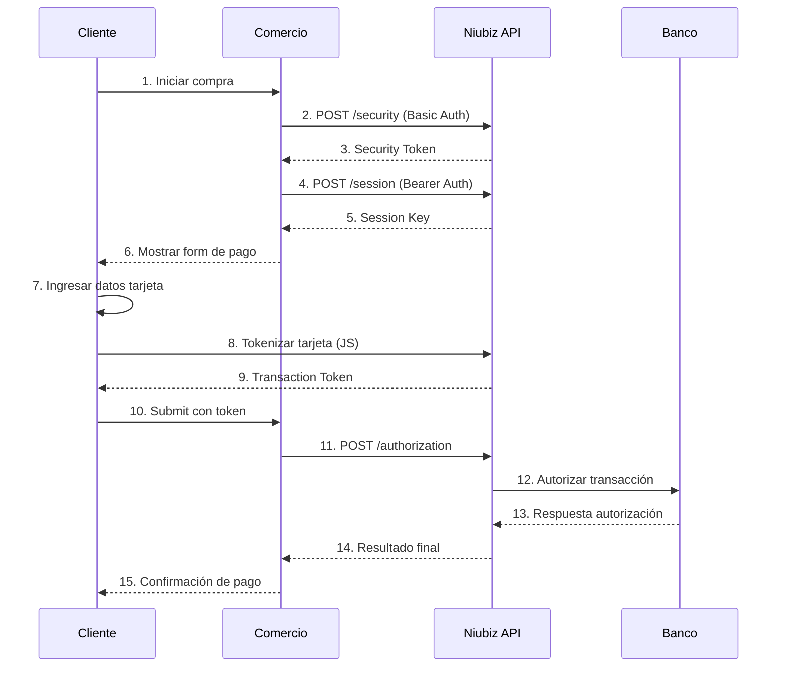

# Documentación API Niubiz - Guía Completa de Integración

## Índice

1. [Visión General](#visión-general)
2. [Autenticación y Seguridad](#autenticación-y-seguridad)
3. [Ambientes Disponibles](#ambientes-disponibles)
4. [Endpoints de la API](#endpoints-de-la-api)
5. [Flujo de Integración](#flujo-de-integración)
6. [Códigos de Respuesta](#códigos-de-respuesta)
7. [Manejo de Errores](#manejo-de-errores)
8. [Ejemplos de Implementación](#ejemplos-de-implementación)
9. [Configuración Frontend](#configuración-frontend)
10. [Testing y Certificación](#testing-y-certificación)
11. [Mejores Prácticas](#mejores-prácticas)

---

## Visión General

**Niubiz** (anteriormente VisaNet) es la plataforma de pagos electrónicos líder en Perú, operada por Visa. La API REST permite a los comercios procesar pagos de manera segura mediante tarjetas de crédito y débito.

### Características Principales

- ✅ **Procesamiento Seguro**: Certificación PCI DSS Level 1
- ✅ **Múltiples Métodos**: Visa, MasterCard, American Express, Diners Club
- ✅ **Tokenización**: Almacenamiento seguro de datos de tarjeta
- ✅ **3D Secure**: Autenticación adicional opcional
- ✅ **Reportería**: Dashboard completo de transacciones
- ✅ **Webhooks**: Notificaciones en tiempo real

### Versiones de API

| Versión | Estado | Descripción |
|---------|--------|-------------|
| **v3** | ✅ Actual | API de autorización más reciente |
| **v2** | ✅ Vigente | API de sesiones y tokens |
| **v1** | ✅ Vigente | API de seguridad y autenticación |

---

## Autenticación y Seguridad

### Credenciales Requeridas

Para integrar con Niubiz necesita las siguientes credenciales:

```json
{
  "merchantId": "400000181",              // ID único del comercio
  "username": "usuario@merchant.com",     // Usuario asignado por Niubiz
  "password": "password123",              // Contraseña del usuario
  "environment": "qa"                     // qa | prod
}
```

### Proceso de Autenticación

#### 1. Security Token (Base64 Authentication)

Primer paso para obtener el token de seguridad:

```http
POST /api.security/v1/security
Authorization: Basic {base64(username:password)}
Content-Type: text/plain
Content-Length: 0
```

**Ejemplo de Implementación**:
```csharp
public async Task<string> GetSecurityTokenAsync()
{
    var credentials = Convert.ToBase64String(
        Encoding.UTF8.GetBytes($"{_username}:{_password}"));

    using var request = new HttpRequestMessage(HttpMethod.Post, "/api.security/v1/security");
    request.Headers.Authorization = new AuthenticationHeaderValue("Basic", credentials);
    request.Content = new StringContent(string.Empty, Encoding.UTF8, "text/plain");

    using var response = await _httpClient.SendAsync(request);
    response.EnsureSuccessStatusCode();

    var token = await response.Content.ReadAsStringAsync();
    return token.Trim().Trim('"'); // Remover comillas si existen
}
```

#### 2. Session Token (Bearer Authentication)

Segundo paso usando el security token:

```http
POST /api.ecommerce/v2/ecommerce/token/session/{merchantId}
Authorization: {securityToken}
Content-Type: application/json
```

### Consideraciones de Seguridad

- **Tokens Temporales**: Los security tokens expiran en 1 hora
- **Session Keys**: Las sesiones expiran en 20 minutos por defecto
- **HTTPS Obligatorio**: Todas las comunicaciones deben usar TLS 1.2+
- **IP Whitelisting**: Configurar IPs permitidas en el portal
- **Rate Limiting**: Máximo 100 requests por minuto por merchant

---

## Ambientes Disponibles

### Ambiente QA (Testing)

**URL Base**: `https://apitestenv.vnforapps.com`

**Características**:
- Ambiente de pruebas y desarrollo
- Datos ficticios sin costo
- Certificados autofirmados válidos
- Respuestas simuladas

**Credenciales de Prueba**:
```json
{
  "merchantId": "400000181",
  "username": "integraciones.visanet@necomplus.com",
  "password": "d5e7nk$M",
  "environment": "qa"
}
```

**Tarjetas de Prueba**:

| Marca | Número | CVV | Exp | Resultado |
|-------|--------|-----|-----|-----------|
| Visa | 4000000000000002 | 123 | 12/25 | ✅ Aprobada |
| Visa | 4000000000000010 | 123 | 12/25 | ❌ Rechazada |
| MasterCard | 5111111111111118 | 123 | 12/25 | ✅ Aprobada |
| Amex | 377777777777770 | 1234 | 12/25 | ✅ Aprobada |

### Ambiente Producción

**URL Base**: `https://apiprod.vnforapps.com`

**Características**:
- Ambiente productivo con transacciones reales
- Certificados SSL válidos
- Monitoreo 24/7
- Facturación real

**Consideraciones**:
- Requiere certificación previa
- Configuración de IPs en portal
- Montos reales cobrados
- Cumplimiento PCI DSS

---

## Endpoints de la API

### 1. Security Token Endpoint

**Obtener Token de Seguridad**

```http
POST /api.security/v1/security
```

**Headers**:
```http
Authorization: Basic {base64(username:password)}
Content-Type: text/plain
```

**Response**:
```json
"eyJhbGciOiJIUzI1NiIsInR5cCI6IkpXVCJ9.eyJpc3MiOiJuaXViaXoiLCJhdWQiOiJtZXJjaGFudCIsImlhdCI6MTY0MjA4MDAwMCwiZXhwIjoxNjQyMDgzNjAwLCJtZXJjaGFudElkIjoiNDAwMDAwMTgxIn0.signature"
```

**Códigos de Estado**:
- `200 OK`: Token generado exitosamente
- `401 Unauthorized`: Credenciales inválidas
- `403 Forbidden`: Merchant no autorizado
- `429 Too Many Requests`: Límite de rate excedido

### 2. Session Creation Endpoint

**Crear Sesión de Pago**

```http
POST /api.ecommerce/v2/ecommerce/token/session/{merchantId}
```

**Headers**:
```http
Authorization: {securityToken}
Content-Type: application/json
Accept: application/json
```

**Request Body**:
```json
{
  "channel": "web",
  "amount": "150.00",
  "antifraud": {
    "clientIp": "192.168.1.100",
    "merchantDefineData": {
      "MDD4": "cliente@email.com",      // Email del cliente
      "MDD30": "40904759",             // DNI del cliente
      "MDD31": "986687645",            // Teléfono del cliente
      "MDD32": "40904759",             // DNI repetido
      "MDD33": "25",                   // Edad del cliente
      "MDD34": "40904759",             // Documento identidad
      "MDD63": "25",                   // Edad repetida
      "MDD65": "40904759",             // Número de documento
      "MDD71": "700526895"             // RUC del comercio
    }
  }
}
```

**Response**:
```json
{
  "sessionKey": "b25b9b7c-4a83-4a5e-8b5c-9d7e8f9g0h1i",
  "expirationTime": 1200,
  "merchantId": "400000181"
}
```

**Parámetros Detallados**:

| Campo | Tipo | Requerido | Descripción |
|-------|------|-----------|-------------|
| `channel` | string | ✅ | Canal de venta: "web", "mobile", "api" |
| `amount` | string | ✅ | Monto en formato decimal: "150.00" |
| `antifraud.clientIp` | string | ✅ | IP del cliente final |
| `antifraud.merchantDefineData` | object | ✅ | Datos para análisis antifraude |

### 3. Authorization Endpoint

**Autorizar Transacción**

```http
POST /api.authorization/v3/authorization/ecommerce/{merchantId}
```

**Headers**:
```http
Authorization: {securityToken}
Content-Type: application/json
Accept: application/json
```

**Request Body**:
```json
{
  "channel": "web",
  "captureType": "automatic",
  "countable": true,
  "order": {
    "tokenId": "{transactionToken}",
    "purchaseNumber": "PUR12345678901",
    "amount": 150.00,
    "currency": "PEN"
  }
}
```

**Response Exitosa (HTTP 200)**:
```json
{
  "order": {
    "actionCode": "000",
    "authorizationCode": "123456",
    "purchaseNumber": "PUR12345678901",
    "amount": 150.00,
    "currency": "PEN",
    "transactionDate": "2024-01-15T14:30:00Z",
    "transactionId": "987654321"
  },
  "dataMap": {
    "CARD": "**** **** **** 1234",
    "BRAND": "visa",
    "TERMINAL": "12345678",
    "ECI": "05"
  }
}
```

**Response Rechazada (HTTP 200)**:
```json
{
  "order": {
    "actionCode": "100",
    "authorizationCode": null,
    "purchaseNumber": "PUR12345678901",
    "amount": 150.00,
    "currency": "PEN"
  },
  "dataMap": {
    "CARD": "**** **** **** 1234",
    "BRAND": "visa",
    "ACTION_DESCRIPTION": "Transaction declined"
  }
}
```

**Parámetros Detallados**:

| Campo | Tipo | Descripción |
|-------|------|-------------|
| `captureType` | string | "automatic" (captura inmediata) o "manual" |
| `countable` | boolean | Si cuenta para el límite de transacciones |
| `order.tokenId` | string | Token generado por el JS de checkout |
| `order.purchaseNumber` | string | Número único de compra (max 20 chars) |
| `order.amount` | decimal | Monto exacto de la transacción |
| `order.currency` | string | Código de moneda ISO: "PEN", "USD" |

---

## Flujo de Integración

### Diagrama de Secuencia



### Implementación Paso a Paso

#### Paso 1: Obtener Security Token

```csharp
public async Task<string> GetSecurityTokenAsync()
{
    var credentials = Convert.ToBase64String(
        Encoding.UTF8.GetBytes($"{_options.Username}:{_options.Password}"));

    var request = new HttpRequestMessage(HttpMethod.Post, _options.SecurityEndpoint);
    request.Headers.Authorization = new AuthenticationHeaderValue("Basic", credentials);
    request.Content = new StringContent(string.Empty, Encoding.UTF8, "text/plain");

    var response = await _httpClient.SendAsync(request);
    
    if (!response.IsSuccessStatusCode)
    {
        var error = await response.Content.ReadAsStringAsync();
        throw new NiubizException($"Error getting security token: {error}");
    }

    var token = await response.Content.ReadAsStringAsync();
    return token.Trim().Trim('"');
}
```

#### Paso 2: Crear Sesión

```csharp
public async Task<SessionResult> CreateSessionAsync(string securityToken, decimal amount, string purchaseNumber)
{
    var requestBody = new
    {
        channel = "web",
        amount = amount.ToString("F2", CultureInfo.InvariantCulture),
        antifraud = new
        {
            clientIp = "127.0.0.1", // IP real del cliente
            merchantDefineData = new
            {
                MDD4 = "cliente@email.com",
                MDD30 = "40904759",
                MDD31 = "986687645",
                // ... otros campos MDD
            }
        }
    };

    var json = JsonSerializer.Serialize(requestBody);
    var content = new StringContent(json, Encoding.UTF8, "application/json");

    var request = new HttpRequestMessage(HttpMethod.Post, 
        _options.SessionEndpoint.Replace("{merchantId}", _options.MerchantId));
    request.Headers.Add("Authorization", securityToken);
    request.Content = content;

    var response = await _httpClient.SendAsync(request);
    response.EnsureSuccessStatusCode();

    var responseBody = await response.Content.ReadAsStringAsync();
    return JsonSerializer.Deserialize<SessionResult>(responseBody);
}
```

#### Paso 3: Frontend Integration

```html
<!DOCTYPE html>
<html>
<head>
    <title>Checkout Niubiz</title>
</head>
<body>
    <form id="payment-form" action="/checkout/confirm" method="post">
        <input type="hidden" name="purchaseNumber" value="@Model.PurchaseNumber" />
        <input type="hidden" id="transactionToken" name="transactionToken" />
    </form>

    <!-- Script de Niubiz -->
    <script type="text/javascript" 
            src="@Model.StaticJsUrl"
            data-sessiontoken="@Model.SessionKey"
            data-channel="web"
            data-merchantid="@Model.MerchantId"
            data-purchasenumber="@Model.PurchaseNumber"
            data-amount="@Model.Amount.ToString("F2")"
            data-currency="@Model.Currency"
            data-expirationminutes="20"
            data-timeouturl="about:blank"
            data-merchantlogo="https://yoursite.com/logo.png"
            data-formbuttoncolor="#007bff">
    </script>

    <script>
        // Callback cuando la tokenización es exitosa
        function culqiSuccessCallback(token) {
            document.getElementById('transactionToken').value = token.token;
            document.getElementById('payment-form').submit();
        }

        // Callback cuando hay errores
        function culqiErrorCallback(error) {
            console.error('Error en tokenización:', error);
            alert('Error procesando el pago. Intente nuevamente.');
        }
    </script>
</body>
</html>
```

#### Paso 4: Autorizar Transacción

```csharp
public async Task<AuthorizationResult> AuthorizeAsync(string securityToken, string transactionToken, 
    decimal amount, string currency, string purchaseNumber)
{
    var requestBody = new
    {
        channel = "web",
        captureType = "automatic",
        countable = true,
        order = new
        {
            tokenId = transactionToken,
            purchaseNumber = purchaseNumber,
            amount = amount,
            currency = currency
        }
    };

    var json = JsonSerializer.Serialize(requestBody);
    var content = new StringContent(json, Encoding.UTF8, "application/json");

    var request = new HttpRequestMessage(HttpMethod.Post, 
        _options.AuthorizationEndpoint.Replace("{merchantId}", _options.MerchantId));
    request.Headers.Add("Authorization", securityToken);
    request.Content = content;

    var response = await _httpClient.SendAsync(request);
    var responseBody = await response.Content.ReadAsStringAsync();

    // Parsear respuesta
    using var doc = JsonDocument.Parse(responseBody);
    var root = doc.RootElement;

    var approved = false;
    string? authCode = null;
    string? maskedCard = null;

    if (root.TryGetProperty("order", out var orderEl))
    {
        approved = orderEl.TryGetProperty("actionCode", out var ac) && ac.GetString() == "000";
        authCode = orderEl.TryGetProperty("authorizationCode", out var au) ? au.GetString() : null;
    }

    if (root.TryGetProperty("dataMap", out var dataMap))
    {
        maskedCard = dataMap.TryGetProperty("CARD", out var card) ? card.GetString() : null;
    }

    return new AuthorizationResult(approved, authCode, maskedCard, responseBody);
}
```

---

## Códigos de Respuesta

### Action Codes (Códigos de Acción)

| Código | Descripción | Tipo | Acción Recomendada |
|--------|-------------|------|-------------------|
| **000** | Transacción aprobada | ✅ Éxito | Completar venta |
| **100** | Transacción rechazada | ❌ Rechazo | Intentar otro método |
| **101** | Tarjeta vencida | ❌ Rechazo | Verificar fecha expiración |
| **102** | Tarjeta restringida | ❌ Rechazo | Contactar banco emisor |
| **103** | Tarjeta reportada como perdida | ❌ Rechazo | No procesar |
| **104** | Tarjeta reportada como robada | ❌ Rechazo | No procesar |
| **105** | Cuenta cerrada | ❌ Rechazo | Usar otra tarjeta |
| **106** | Cuenta suspendida | ❌ Rechazo | Contactar banco |
| **200** | Fondos insuficientes | ❌ Rechazo | Verificar saldo |
| **201** | Límite de crédito excedido | ❌ Rechazo | Reducir monto |
| **202** | CVV incorrecto | ❌ Rechazo | Verificar código seguridad |
| **203** | Fecha expiración incorrecta | ❌ Rechazo | Verificar datos |
| **300** | Error en comunicación | ⚠️ Error | Reintentar |
| **301** | Timeout en la transacción | ⚠️ Error | Verificar estado |
| **400** | Error en formato de datos | ❌ Error | Revisar request |
| **500** | Error interno del servidor | ⚠️ Error | Contactar soporte |

### HTTP Status Codes

| Código | Descripción | Significado |
|--------|-------------|-------------|
| **200 OK** | Petición procesada | Revisar actionCode |
| **400 Bad Request** | Datos inválidos | Corregir formato |
| **401 Unauthorized** | Credenciales inválidas | Verificar auth |
| **403 Forbidden** | Acceso denegado | Verificar permisos |
| **404 Not Found** | Endpoint no existe | Revisar URL |
| **429 Too Many Requests** | Rate limit excedido | Implementar retry |
| **500 Internal Server Error** | Error servidor | Contactar soporte |
| **502 Bad Gateway** | Gateway error | Reintentar después |
| **503 Service Unavailable** | Servicio no disponible | Mantenimiento |

---

## Manejo de Errores

### Estrategia de Reintentos

```csharp
public class NiubizRetryPolicy
{
    private static readonly TimeSpan[] RetryDelays = {
        TimeSpan.FromSeconds(1),
        TimeSpan.FromSeconds(2),
        TimeSpan.FromSeconds(4)
    };

    public async Task<T> ExecuteAsync<T>(Func<Task<T>> operation)
    {
        for (int attempt = 0; attempt <= RetryDelays.Length; attempt++)
        {
            try
            {
                return await operation();
            }
            catch (HttpRequestException ex) when (attempt < RetryDelays.Length)
            {
                await Task.Delay(RetryDelays[attempt]);
            }
            catch (TaskCanceledException ex) when (attempt < RetryDelays.Length)
            {
                await Task.Delay(RetryDelays[attempt]);
            }
        }

        throw new NiubizException("Max retry attempts exceeded");
    }
}
```

### Logging Detallado

```csharp
public class NiubizClient
{
    private readonly ILogger<NiubizClient> _logger;

    public async Task<AuthorizationResult> AuthorizeAsync(...)
    {
        _logger.LogInformation("Starting authorization for purchase {PurchaseNumber}", purchaseNumber);
        
        try
        {
            var response = await _httpClient.SendAsync(request);
            var body = await response.Content.ReadAsStringAsync();

            _logger.LogInformation("Authorization response for {PurchaseNumber}: {StatusCode}", 
                purchaseNumber, response.StatusCode);

            if (!response.IsSuccessStatusCode)
            {
                _logger.LogWarning("Authorization failed for {PurchaseNumber}: {Body}", 
                    purchaseNumber, body);
                throw new NiubizException($"Authorization failed: {body}");
            }

            return ParseAuthorizationResult(body);
        }
        catch (Exception ex)
        {
            _logger.LogError(ex, "Error during authorization for {PurchaseNumber}", purchaseNumber);
            throw;
        }
    }
}
```

### Validaciones Pre-Envío

```csharp
public class NiubizValidator
{
    public void ValidateCreateSession(decimal amount, string purchaseNumber)
    {
        if (amount <= 0)
            throw new ValidationException("Amount must be greater than zero");

        if (amount > 999999.99m)
            throw new ValidationException("Amount exceeds maximum allowed");

        if (string.IsNullOrWhiteSpace(purchaseNumber))
            throw new ValidationException("Purchase number is required");

        if (purchaseNumber.Length > 20)
            throw new ValidationException("Purchase number exceeds 20 characters");

        if (!Regex.IsMatch(purchaseNumber, @"^[a-zA-Z0-9]+$"))
            throw new ValidationException("Purchase number contains invalid characters");
    }
}
```

---

## Configuración Frontend

### JavaScript Personalizado

```javascript
// Configuración avanzada del checkout
const NiubizCheckout = {
    init: function(config) {
        // Configurar eventos
        this.setupEventListeners();
        
        // Validar configuración
        this.validateConfig(config);
        
        // Cargar script de Niubiz
        this.loadNiubizScript(config);
    },

    setupEventListeners: function() {
        // Interceptar submit del formulario
        document.getElementById('payment-form').addEventListener('submit', function(e) {
            if (!document.getElementById('transactionToken').value) {
                e.preventDefault();
                alert('Por favor complete los datos de su tarjeta');
                return false;
            }
        });
    },

    validateConfig: function(config) {
        const required = ['sessionKey', 'merchantId', 'purchaseNumber', 'amount'];
        for (let field of required) {
            if (!config[field]) {
                throw new Error(`Missing required field: ${field}`);
            }
        }
    },

    loadNiubizScript: function(config) {
        const script = document.createElement('script');
        script.src = config.staticJsUrl;
        script.setAttribute('data-sessiontoken', config.sessionKey);
        script.setAttribute('data-channel', 'web');
        script.setAttribute('data-merchantid', config.merchantId);
        script.setAttribute('data-purchasenumber', config.purchaseNumber);
        script.setAttribute('data-amount', config.amount);
        script.setAttribute('data-currency', config.currency || 'PEN');
        script.setAttribute('data-expirationminutes', '20');
        
        document.head.appendChild(script);
    }
};

// Callbacks globales de Niubiz
function culqiSuccessCallback(token) {
    console.log('Token received:', token.token);
    document.getElementById('transactionToken').value = token.token;
    document.getElementById('payment-form').submit();
}

function culqiErrorCallback(error) {
    console.error('Niubiz error:', error);
    
    let message = 'Error procesando el pago';
    switch(error.code) {
        case 'card_number_invalid':
            message = 'Número de tarjeta inválido';
            break;
        case 'card_expiry_invalid':
            message = 'Fecha de expiración inválida';
            break;
        case 'card_cvv_invalid':
            message = 'Código CVV inválido';
            break;
        case 'session_expired':
            message = 'La sesión ha expirado. Recargue la página';
            break;
    }
    
    alert(message);
}
```

### CSS Personalizado

```css
/* Estilos para el formulario de Niubiz */
.niubiz-form {
    max-width: 400px;
    margin: 0 auto;
    padding: 20px;
    border: 1px solid #ddd;
    border-radius: 8px;
    background-color: #fff;
}

.niubiz-button {
    background-color: #007bff;
    color: white;
    border: none;
    padding: 12px 24px;
    border-radius: 4px;
    cursor: pointer;
    font-size: 16px;
    width: 100%;
}

.niubiz-button:hover {
    background-color: #0056b3;
}

.niubiz-button:disabled {
    background-color: #6c757d;
    cursor: not-allowed;
}

/* Indicador de carga */
.loading-spinner {
    display: inline-block;
    width: 20px;
    height: 20px;
    border: 3px solid #f3f3f3;
    border-top: 3px solid #007bff;
    border-radius: 50%;
    animation: spin 1s linear infinite;
}

@keyframes spin {
    0% { transform: rotate(0deg); }
    100% { transform: rotate(360deg); }
}
```

---

## Testing y Certificación

### Casos de Prueba Obligatorios

#### 1. Transacciones Exitosas

```csharp
[Test]
public async Task AuthorizeAsync_WithValidData_ShouldReturnApproved()
{
    // Arrange
    var amount = 100.00m;
    var purchaseNumber = "TEST" + DateTime.Now.Ticks;
    
    // Act
    var initResult = await _checkoutService.InitAsync(productId, "test@email.com");
    var token = await GetTestTransactionToken(initResult.SessionKey);
    var result = await _checkoutService.ConfirmAsync(purchaseNumber, token);
    
    // Assert
    Assert.IsTrue(result.Success);
    Assert.IsNotNull(result.AuthorizationCode);
    Assert.AreEqual("000", result.ActionCode);
}
```

#### 2. Transacciones Rechazadas

```csharp
[Test]
public async Task AuthorizeAsync_WithDeclinedCard_ShouldReturnRejected()
{
    // Usar tarjeta de prueba rechazada: 4000000000000010
    var result = await AuthorizeWithTestCard("4000000000000010");
    
    Assert.IsFalse(result.Success);
    Assert.AreEqual("100", result.ActionCode);
}
```

#### 3. Manejo de Errores

```csharp
[Test]
public async Task AuthorizeAsync_WithInvalidToken_ShouldThrowException()
{
    await Assert.ThrowsAsync<NiubizException>(async () =>
    {
        await _niubizClient.AuthorizeAsync(securityToken, "invalid_token", 100, "PEN", "TEST123");
    });
}
```

### Herramientas de Testing

#### Postman Collection

```json
{
  "info": {
    "name": "Niubiz API Tests",
    "schema": "https://schema.getpostman.com/json/collection/v2.1.0/collection.json"
  },
  "item": [
    {
      "name": "Get Security Token",
      "request": {
        "method": "POST",
        "header": [
          {
            "key": "Authorization",
            "value": "Basic {{basicAuth}}"
          },
          {
            "key": "Content-Type",
            "value": "text/plain"
          }
        ],
        "url": {
          "raw": "{{baseUrl}}/api.security/v1/security",
          "host": ["{{baseUrl}}"],
          "path": ["api.security", "v1", "security"]
        }
      }
    }
  ],
  "variable": [
    {
      "key": "baseUrl",
      "value": "https://apitestenv.vnforapps.com"
    },
    {
      "key": "basicAuth",
      "value": "base64(username:password)"
    }
  ]
}
```

### Certificación para Producción

#### Checklist de Certificación

- [ ] **Casos de Prueba**: Completar todos los escenarios obligatorios
- [ ] **Seguridad**: Implementar HTTPS y validaciones
- [ ] **Manejo de Errores**: Gestión correcta de todos los códigos
- [ ] **Logging**: Trazabilidad completa de transacciones
- [ ] **Performance**: Tiempos de respuesta aceptables
- [ ] **UX**: Interfaz de usuario intuitiva
- [ ] **Rollback**: Capacidad de reversar transacciones
- [ ] **Monitoreo**: Alertas y dashboards configurados

---

## Mejores Prácticas

### 1. Seguridad

```csharp
// ✅ Buena práctica: Validar todos los inputs
public async Task<CheckoutInitResult> InitAsync(Guid productId, string? customerEmail)
{
    // Validar producto existe
    var product = await _products.GetByIdAsync(productId);
    if (product is null) 
        throw new KeyNotFoundException("Producto no encontrado");

    // Validar email si se proporciona
    if (!string.IsNullOrWhiteSpace(customerEmail) && !IsValidEmail(customerEmail))
        throw new ArgumentException("Email inválido");

    // Validar monto
    if (product.Price <= 0 || product.Price > 999999.99m)
        throw new ArgumentException("Monto inválido");

    // Continuar con la lógica...
}

private bool IsValidEmail(string email)
{
    return Regex.IsMatch(email, @"^[^@\s]+@[^@\s]+\.[^@\s]+$");
}
```

### 2. Performance

```csharp
// ✅ Implementar caché para security tokens
public class CachedNiubizClient : INiubizGateway
{
    private readonly INiubizGateway _inner;
    private readonly IMemoryCache _cache;
    private readonly TimeSpan _tokenCacheDuration = TimeSpan.FromMinutes(55); // 5 min antes del expiry

    public async Task<string> GetSecurityTokenAsync(CancellationToken ct = default)
    {
        var cacheKey = $"niubiz:token:{_options.MerchantId}";
        
        if (_cache.TryGetValue(cacheKey, out string? cachedToken))
        {
            return cachedToken!;
        }

        var token = await _inner.GetSecurityTokenAsync(ct);
        _cache.Set(cacheKey, token, _tokenCacheDuration);
        
        return token;
    }
}
```

### 3. Resilencia

```csharp
// ✅ Implementar Circuit Breaker
public class NiubizCircuitBreaker
{
    private int _failureCount = 0;
    private DateTime _lastFailureTime = DateTime.MinValue;
    private readonly int _failureThreshold = 5;
    private readonly TimeSpan _timeout = TimeSpan.FromMinutes(1);

    public async Task<T> ExecuteAsync<T>(Func<Task<T>> operation)
    {
        if (_failureCount >= _failureThreshold && 
            DateTime.UtcNow - _lastFailureTime < _timeout)
        {
            throw new CircuitBreakerOpenException("Circuit breaker is open");
        }

        try
        {
            var result = await operation();
            _failureCount = 0; // Reset on success
            return result;
        }
        catch (Exception)
        {
            _failureCount++;
            _lastFailureTime = DateTime.UtcNow;
            throw;
        }
    }
}
```

### 4. Monitoreo

```csharp
// ✅ Métricas personalizadas
public class NiubizMetrics
{
    private readonly IMetrics _metrics;

    public void RecordTransaction(string result, decimal amount, TimeSpan duration)
    {
        _metrics.Measure.Counter.Increment("niubiz.transactions.total", 
            new MetricTags("result", result));
            
        _metrics.Measure.Gauge.SetValue("niubiz.transactions.amount", amount,
            new MetricTags("result", result));
            
        _metrics.Measure.Timer.Time("niubiz.transactions.duration", duration,
            new MetricTags("result", result));
    }
}
```

### 5. Testing

```csharp
// ✅ Mock para testing
public class MockNiubizGateway : INiubizGateway
{
    public async Task<string> GetSecurityTokenAsync(CancellationToken ct = default)
    {
        await Task.Delay(100, ct); // Simular latencia de red
        return "mock_security_token_" + Guid.NewGuid();
    }

    public async Task<AuthorizationResult> AuthorizeAsync(string securityToken, 
        string transactionToken, decimal amount, string currency, string purchaseNumber, 
        CancellationToken ct = default)
    {
        await Task.Delay(200, ct);

        // Simular diferentes escenarios basados en el monto
        var approved = amount < 1000; // Rechazar montos altos
        var authCode = approved ? "123456" : null;
        
        return new AuthorizationResult(approved, authCode, "**** 1234", "{}");
    }
}
```

---

## Soporte y Recursos

### Documentación Oficial

- **Portal Desarrolladores**: https://desarrolladores.niubiz.com.pe/
- **API Reference**: https://desarrolladores.niubiz.com.pe/api/
- **Guías de Integración**: https://desarrolladores.niubiz.com.pe/guides/

### Contacto Técnico

- **Email Soporte**: soporte@niubiz.com.pe
- **Horario**: Lunes a Viernes 8:00 AM - 6:00 PM (GMT-5)
- **Teléfono**: +51 1 211-5000 (Opción 3)

### Recursos Adicionales

- **SDKs Oficiales**: Disponibles para PHP, Java, .NET
- **Postman Collection**: Colección completa de endpoints
- **Webhook Testing**: Herramientas para probar notificaciones
- **Status Page**: https://status.niubiz.com.pe/

---

**Nota**: Esta documentación está basada en la API v3 de Niubiz (2024). Siempre consulte la documentación oficial más reciente para cambios y actualizaciones.