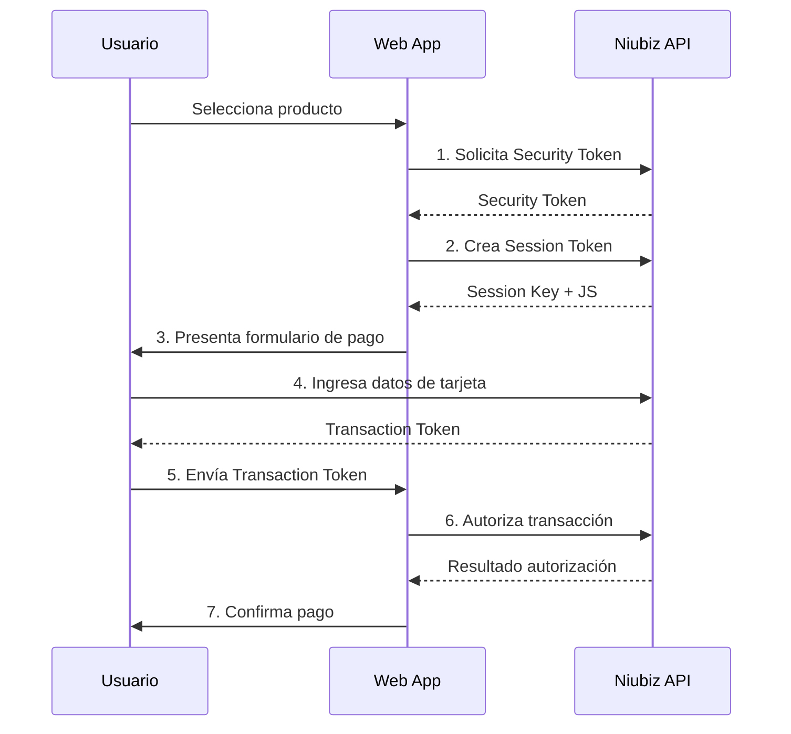

# 💳 Guía de Integración Niubiz

## Introducción a Niubiz

**Niubiz** (anteriormente VisaNet) es la plataforma de pagos electrónicos líder en Perú, que permite a los comercios procesar pagos con tarjetas de crédito y débito de forma segura y confiable.

## 🔑 Conceptos Fundamentales

### Flujo de Autenticación y Pago



### Tokens Utilizados

1. **Security Token**: Autenticación básica con el API
2. **Session Key**: Sesión temporal para el formulario de pago
3. **Transaction Token**: Token generado tras captura de datos de tarjeta

## 🛠️ Implementación Técnica

### 1. Configuración Inicial

#### NiubizOptions
```csharp
public class NiubizOptions
{
    public string Environment { get; set; } = "qa";          // "qa" o "prod"
    public string MerchantId { get; set; } = default!;       // ID del comercio
    public string Username { get; set; } = default!;         // Usuario API
    public string Password { get; set; } = default!;         // Contraseña API
    public string Currency { get; set; } = "PEN";            // Moneda (PEN, USD)
    public string BaseUrl { get; set; } = default!;          // URL base del API
    public string StaticJsUrl { get; set; } = default!;      // URL del JS de checkout
    
    // Endpoints configurables
    public string SecurityEndpoint { get; set; } = "/api.security/v1/security";
    public string SessionEndpoint { get; set; } = "/api.ecommerce/v2/ecommerce/token/session/{merchantId}";
    public string AuthorizationEndpoint { get; set; } = "/api.authorization/v3/authorization/ecommerce/{merchantId}";
}
```

#### Configuración en DI Container
```csharp
services.Configure<NiubizOptions>(configuration.GetSection("Niubiz"))
    .Validate(o => !string.IsNullOrWhiteSpace(o.MerchantId), "MerchantId requerido")
    .Validate(o => !string.IsNullOrWhiteSpace(o.Username), "Username requerido")
    .Validate(o => !string.IsNullOrWhiteSpace(o.Password), "Password requerido");
```

### 2. Cliente Niubiz (NiubizClient)

#### Autenticación - Security Token
```csharp
public async Task<string> GetSecurityTokenAsync(CancellationToken ct = default)
{
    var credentials = Convert.ToBase64String(
        Encoding.GetEncoding("ISO-8859-1").GetBytes($"{_opt.Username}:{_opt.Password}")
    );
    
    using var req = new HttpRequestMessage(HttpMethod.Post, _opt.SecurityEndpoint);
    req.Headers.Authorization = new AuthenticationHeaderValue("Basic", credentials);
    req.Headers.Accept.Add(new MediaTypeWithQualityHeaderValue("application/json"));
    req.Content = new StringContent("{}", Encoding.UTF8, "application/json");
    
    var res = await _http.SendAsync(req, ct);
    var content = await res.Content.ReadAsStringAsync(ct);
    
    if (!res.IsSuccessStatusCode)
        throw new InvalidOperationException($"Error obteniendo security token: {res.StatusCode} - {content}");
    
    return content.Trim('"'); // Niubiz devuelve el token entre comillas
}
```

#### Creación de Sesión
```csharp
public async Task<string> CreateSessionAsync(
    string securityToken, 
    decimal amount, 
    string purchaseNumber, 
    string currency, 
    CancellationToken ct = default)
{
    var endpoint = _opt.SessionEndpoint.Replace("{merchantId}", _opt.MerchantId);
    
    var body = new
    {
        channel = "web",
        captureType = "manual",
        countable = true,
        order = new
        {
            tokenId = securityToken,
            purchaseNumber,
            amount = amount.ToString("F2", CultureInfo.InvariantCulture),
            currency
        },
        // Datos adicionales para prevención de fraude
        antifraud = new
        {
            clientIp = "127.0.0.1",
            merchantDefineData = new
            {
                MDD4 = "integraciones.visanet@necomplus.com",
                MDD21 = "0",
                MDD32 = "VN0000000",
                MDD75 = "Registrado",
                MDD77 = 0
            }
        }
    };
    
    var jsonBody = JsonSerializer.Serialize(body);
    
    using var req = new HttpRequestMessage(HttpMethod.Post, endpoint);
    req.Headers.Authorization = new AuthenticationHeaderValue("Bearer", securityToken);
    req.Content = new StringContent(jsonBody, Encoding.UTF8, "application/json");
    
    var res = await _http.SendAsync(req, ct);
    var content = await res.Content.ReadAsStringAsync(ct);
    
    if (!res.IsSuccessStatusCode)
        throw new InvalidOperationException($"Error creando sesión: {res.StatusCode} - {content}");
    
    var sessionResponse = JsonSerializer.Deserialize<JsonElement>(content);
    return sessionResponse.GetProperty("sessionKey").GetString()!;
}
```

#### Autorización de Pago
```csharp
public async Task<AuthorizationResult> AuthorizeAsync(
    string securityToken,
    string transactionToken,
    decimal amount,
    string currency,
    string purchaseNumber,
    CancellationToken ct = default)
{
    var endpoint = _opt.AuthorizationEndpoint.Replace("{merchantId}", _opt.MerchantId);
    
    var body = new
    {
        antifraud = new
        {
            clientIp = "127.0.0.1",
            merchantDefineData = new
            {
                MDD4 = "integraciones.visanet@necomplus.com",
                MDD21 = "0",
                MDD32 = "VN0000000",
                MDD75 = "Registrado",
                MDD77 = 0
            }
        },
        captureType = "manual",
        channel = "web",
        countable = true,
        order = new
        {
            tokenId = transactionToken,
            purchaseNumber,
            amount = amount.ToString("F2", CultureInfo.InvariantCulture),
            currency
        },
        sponsored = new
        {
            amount = amount.ToString("F2", CultureInfo.InvariantCulture),
            beneficiaryId = "0",
            frequency = "FALSE",
            maxAmount = amount.ToString("F2", CultureInfo.InvariantCulture),
            type = ""
        }
    };
    
    var jsonBody = JsonSerializer.Serialize(body);
    
    using var req = new HttpRequestMessage(HttpMethod.Post, endpoint);
    req.Headers.Authorization = new AuthenticationHeaderValue("Bearer", securityToken);
    req.Content = new StringContent(jsonBody, Encoding.UTF8, "application/json");
    
    var res = await _http.SendAsync(req, ct);
    var content = await res.Content.ReadAsStringAsync(ct);
    
    // Procesar respuesta y determinar si fue aprobada
    var approved = false;
    string? authCode = null;
    string? maskedCard = null;
    
    try
    {
        var authResponse = JsonSerializer.Deserialize<JsonElement>(content);
        
        if (authResponse.TryGetProperty("dataMap", out var dataMap))
        {
            if (dataMap.TryGetProperty("ACTION_CODE", out var actionCode))
            {
                approved = actionCode.GetString() == "000"; // "000" indica éxito
            }
            
            if (dataMap.TryGetProperty("ID", out var idElement))
            {
                authCode = idElement.GetString();
            }
            
            if (dataMap.TryGetProperty("CARD", out var cardElement))
            {
                maskedCard = cardElement.GetString();
            }
        }
    }
    catch (JsonException ex)
    {
        _logger.LogError(ex, "Error parsing authorization response");
    }
    
    return new AuthorizationResult(approved, authCode, maskedCard, content);
}
```

### 3. Servicio de Checkout

#### Inicialización del Pago
```csharp
public async Task<CheckoutInitResult> InitAsync(
    Guid productId, 
    string? customerEmail, 
    CancellationToken ct = default)
{
    // 1. Obtener producto
    var product = await _productRepo.GetByIdAsync(productId, ct);
    if (product == null)
        throw new KeyNotFoundException($"Producto {productId} no encontrado");
    
    // 2. Crear orden
    var order = new Order
    {
        Id = Guid.NewGuid(),
        PurchaseNumber = GeneratePurchaseNumber(),
        Amount = product.Price,
        Currency = "PEN",
        CustomerEmail = customerEmail,
        Status = OrderStatus.Pending
    };
    
    await _orderRepo.AddAsync(order, ct);
    
    // 3. Obtener tokens de Niubiz
    var securityToken = await _niubizGateway.GetSecurityTokenAsync(ct);
    var sessionKey = await _niubizGateway.CreateSessionAsync(
        securityToken, 
        order.Amount, 
        order.PurchaseNumber, 
        order.Currency, 
        ct
    );
    
    // 4. Guardar transacción inicial
    var payment = new PaymentTransaction
    {
        Id = Guid.NewGuid(),
        OrderId = order.Id,
        SessionKey = sessionKey,
        Status = "INIT"
    };
    
    await _paymentRepo.AddAsync(payment, ct);
    
    // 5. Retornar datos para el frontend
    return new CheckoutInitResult(
        _niubizOptions.MerchantId,
        sessionKey,
        order.PurchaseNumber,
        order.Amount,
        order.Currency,
        _niubizOptions.StaticJsUrl
    );
}
```

#### Confirmación del Pago
```csharp
public async Task<ConfirmResult> ConfirmAsync(
    string purchaseNumber, 
    string transactionToken, 
    CancellationToken ct = default)
{
    // 1. Buscar orden
    var order = await _orderRepo.GetByPurchaseNumberAsync(purchaseNumber, ct);
    if (order == null)
        return new ConfirmResult(false, purchaseNumber, null, "Orden no encontrada", null, "{}");
    
    // 2. Obtener transacción
    var payment = await _paymentRepo.GetByOrderIdAsync(order.Id, ct);
    if (payment == null)
        return new ConfirmResult(false, purchaseNumber, null, "Transacción no encontrada", null, "{}");
    
    try
    {
        // 3. Autorizar con Niubiz
        var securityToken = await _niubizGateway.GetSecurityTokenAsync(ct);
        var authResult = await _niubizGateway.AuthorizeAsync(
            securityToken,
            transactionToken,
            order.Amount,
            order.Currency,
            order.PurchaseNumber,
            ct
        );
        
        // 4. Actualizar registros
        payment.TransactionToken = transactionToken;
        payment.AuthorizationCode = authResult.AuthorizationCode;
        payment.MaskedCard = authResult.MaskedCard;
        payment.Status = authResult.Approved ? "AUTHORIZED" : "FAILED";
        payment.RawResponse = authResult.RawJson;
        
        order.Status = authResult.Approved ? OrderStatus.Paid : OrderStatus.Rejected;
        
        await _paymentRepo.UpdateAsync(payment, ct);
        await _orderRepo.UpdateAsync(order, ct);
        
        var message = authResult.Approved ? "Pago procesado exitosamente" : "Pago rechazado";
        
        return new ConfirmResult(
            authResult.Approved,
            purchaseNumber,
            authResult.AuthorizationCode,
            message,
            authResult.MaskedCard,
            authResult.RawJson
        );
    }
    catch (Exception ex)
    {
        _logger.LogError(ex, "Error confirmando pago para orden {PurchaseNumber}", purchaseNumber);
        
        // Actualizar como error
        payment.Status = "ERROR";
        order.Status = OrderStatus.Error;
        
        await _paymentRepo.UpdateAsync(payment, ct);
        await _orderRepo.UpdateAsync(order, ct);
        
        return new ConfirmResult(false, purchaseNumber, null, "Error procesando pago", null, "{}");
    }
}
```

## 🎨 Frontend - Formulario de Pago

### Vista Razor (Pay.cshtml)
```html
@model IntegracionNiubizDemo.Application.Dtos.CheckoutInitResult

<div class="payment-container">
    <h2>Procesar Pago</h2>
    
    <div class="payment-info">
        <p><strong>Monto:</strong> @Model.Amount.ToString("C")</p>
        <p><strong>Moneda:</strong> @Model.Currency</p>
        <p><strong>Número de Compra:</strong> @Model.PurchaseNumber</p>
    </div>
    
    <!-- Formulario que será procesado por Niubiz JS -->
    <form action="/checkout/confirm" method="post" id="payment-form">
        <input type="hidden" name="purchaseNumber" value="@Model.PurchaseNumber" />
        <input type="hidden" name="transactionToken" id="transactionToken" />
        
        <!-- Contenedor para el formulario de Niubiz -->
        <div id="niubiz-form"></div>
        
        <button type="submit" id="pay-button" style="display:none;">
            Confirmar Pago
        </button>
    </form>
</div>

<script src="@Model.StaticJsUrl"></script>
<script>
    // Configuración del checkout de Niubiz
    window.VisanetCheckout = {
        settings: {
            merchantId: '@Model.MerchantId',
            sessionKey: '@Model.SessionKey',
            amount: '@Model.Amount.ToString("F2")',
            currency: '@Model.Currency',
            purchaseNumber: '@Model.PurchaseNumber'
        },
        onComplete: function(token) {
            // Token recibido desde Niubiz
            document.getElementById('transactionToken').value = token;
            document.getElementById('pay-button').click();
        },
        onError: function(error) {
            console.error('Error en el checkout:', error);
            alert('Error procesando el pago. Inténtalo nuevamente.');
        }
    };
    
    // Inicializar el formulario de Niubiz
    window.addEventListener('load', function() {
        if (typeof VisanetCheckout !== 'undefined') {
            VisanetCheckout.init('#niubiz-form');
        }
    });
</script>
```

## 🔧 Configuración por Ambiente

### Ambiente QA/Testing
```json
{
  "Niubiz": {
    "Environment": "qa",
    "BaseUrl": "https://apitestenv.vnforapps.com",
    "StaticJsUrl": "https://static-content-qas.vnforapps.com/v2/js/checkout.js",
    "MerchantId": "522591303",
    "Username": "integraciones.visanet@necomplus.com",
    "Password": "d5e7nk$M"
  }
}
```

### Ambiente Producción
```json
{
  "Niubiz": {
    "Environment": "prod",
    "BaseUrl": "https://api.vnforapps.com",
    "StaticJsUrl": "https://static-content.vnforapps.com/v2/js/checkout.js",
    "MerchantId": "TU_MERCHANT_ID_PROD",
    "Username": "TU_USERNAME_PROD",
    "Password": "TU_PASSWORD_PROD"
  }
}
```

## 🛡️ Seguridad y Mejores Prácticas

### 1. Manejo de Credenciales
- ✅ Usar User Secrets en desarrollo
- ✅ Variables de entorno en producción
- ✅ Nunca hardcodear credenciales
- ✅ Rotación periódica de passwords

### 2. Validaciones
- ✅ Validar montos antes de enviar
- ✅ Verificar formato de purchaseNumber
- ✅ Timeout en requests HTTP
- ✅ Retry logic para fallos temporales

### 3. Logging y Monitoreo
- ✅ Log de todas las transacciones
- ✅ Monitoring de tasas de éxito/fallo
- ✅ Alertas por errores críticos
- ✅ Audit trail completo

### 4. Manejo de Errores
```csharp
public class NiubizException : Exception
{
    public string? ErrorCode { get; }
    public string? RawResponse { get; }
    
    public NiubizException(string message, string? errorCode = null, string? rawResponse = null) 
        : base(message)
    {
        ErrorCode = errorCode;
        RawResponse = rawResponse;
    }
}
```

## 📊 Códigos de Respuesta Niubiz

### Códigos de Autorización
- **000**: Autorizado
- **100**: Transacción denegada
- **101**: Tarjeta expirada
- **102**: Tarjeta restringida
- **103**: Contactar emisor
- **200**: Transacción cancelada

### Estados de Transacción
- **INIT**: Transacción iniciada
- **AUTHORIZED**: Autorizada exitosamente
- **FAILED**: Falló la autorización
- **ERROR**: Error del sistema
- **CANCELLED**: Cancelada por usuario

## 🧪 Testing

### Unit Tests para NiubizClient
```csharp
[Test]
public async Task GetSecurityTokenAsync_WithValidCredentials_ReturnsToken()
{
    // Arrange
    var mockHttp = new MockHttpMessageHandler();
    mockHttp.When("*/api.security/v1/security")
           .Respond("application/json", "\"test-token-123\"");
    
    var client = new NiubizClient(mockHttp.ToHttpClient(), options, logger);
    
    // Act
    var token = await client.GetSecurityTokenAsync();
    
    // Assert
    Assert.That(token, Is.EqualTo("test-token-123"));
}
```

### Integration Tests
```csharp
[Test]
public async Task FullPaymentFlow_WithTestCredentials_CompletesSuccessfully()
{
    // Test completo del flujo de pago usando ambiente de QA
}
```

## 📚 Referencias

- [Documentación Oficial Niubiz](https://github.com/niubiz)
- [API Reference](https://apitestenv.vnforapps.com/api-docs)
- [Códigos de Error](https://github.com/niubiz/niubiz-api-docs/blob/main/error-codes.md)