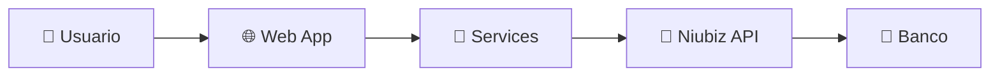

# 📚 Índice de Documentación - Integración Niubiz Demo

Bienvenido a la documentación completa del proyecto de integración con Niubiz. Esta documentación está diseñada para desarrolladores terceros que desean integrar la plataforma de pagos Niubiz en sus aplicaciones.

## 📖 Documentación Principal

### [📋 README.md](../README.md)
Documento principal con visión general del proyecto, arquitectura e instrucciones básicas de uso.

**Contenido:**
- Introducción y objetivos
- Arquitectura Clean Architecture con diagramas
- Configuración básica
- APIs principales
- Flujo de pago
- Ejemplos básicos

### [⚠️ ESTADO_ACTUAL.md](../ESTADO_ACTUAL.md)
Estado actual de la aplicación y qué necesitas para hacerla funcionar completamente.

**Contenido:**
- Screenshots de la aplicación funcionando
- Configuración pendiente
- Pasos para funcionamiento completo
- Debugging y troubleshooting

## 🗂️ Documentación Detallada por Secciones

### 🏗️ Arquitectura
📁 **[docs/architecture/](architecture/)**

Documentación técnica profunda sobre la arquitectura del sistema.

**Incluye:**
- Diagrama de componentes con Mermaid
- Flujo de datos detallado
- Patrones implementados (Repository, DI, Options, Adapter)
- Responsabilidades por capa
- Consideraciones de seguridad
- Estrategias de escalabilidad
- Testing y monitoreo

---

### 🔌 APIs
📁 **[docs/api/](api/)**

Documentación completa de todas las APIs disponibles.

**Incluye:**
- APIs Web (Controllers y endpoints)
- APIs de servicio (Application layer)
- APIs de repositorio (Data layer)
- Modelos de datos y DTOs
- Códigos de respuesta Niubiz
- Manejo de errores
- Ejemplos con curl y Postman

---

### ⚙️ Configuración e Instalación
📁 **[docs/setup/](setup/)**

Guía completa de instalación y configuración.

**Incluye:**
- Requisitos del sistema
- Instalación paso a paso
- Configuración por ambientes (Dev/Prod)
- Configuración de Niubiz
- Base de datos (SQLite, SQL Server, MySQL)
- Docker y containerización
- Configuraciones de seguridad
- Troubleshooting de configuración

---

### 💡 Ejemplos de Integración
📁 **[docs/examples/](examples/)**

Casos de uso prácticos y ejemplos de código.

**Incluye:**
- E-commerce básico con API REST
- Marketplace multi-vendedor
- Suscripciones y pagos recurrentes
- Webhook handlers
- Unit tests y integration tests
- Monitoreo con Application Insights
- Frontend JavaScript completo

---

### 🔄 Flujo Técnico
📁 **[docs/flow/](flow/)**

Documentación técnica del flujo de pago con diagramas detallados.

**Incluye:**
- Diagrama de secuencia completo
- Estados de entidades
- Flujo de datos paso a paso
- Configuración de endpoints Niubiz
- Códigos de respuesta y manejo de errores
- Configuración de timeouts y retry logic
- Logging y métricas

## 🎯 Rutas de Aprendizaje

### 👋 Para Comenzar Rápidamente
1. 📖 [README.md](../README.md) - Visión general
2. ⚙️ [Configuración](setup/) - Instalar y configurar
3. ⚠️ [Estado Actual](../ESTADO_ACTUAL.md) - Verificar funcionamiento

### 🔧 Para Desarrolladores
1. 🏗️ [Arquitectura](architecture/) - Entender el diseño
2. 🔌 [APIs](api/) - Conocer las interfaces
3. 🔄 [Flujo Técnico](flow/) - Comprender el proceso

### 💼 Para Integraciones Avanzadas
1. 💡 [Ejemplos](examples/) - Casos de uso reales
2. 🏗️ [Patrones](architecture/) - Mejores prácticas
3. 🔄 [Flujo](flow/) - Debugging y optimización

## 📊 Diagramas y Gráficos

La documentación incluye múltiples diagramas creados con **Mermaid**:

### Tipos de Diagramas Disponibles

- 🔄 **Diagramas de Secuencia**: Flujo completo de pago
- 🏗️ **Diagramas de Componentes**: Arquitectura del sistema
- 📊 **Diagramas de Estado**: Ciclo de vida de entidades
- 🌊 **Diagramas de Flujo**: Lógica de decisiones
- 🎯 **Diagramas de Casos de Uso**: Scenarios de integración

### Ejemplos Visuales



## 🛠️ Herramientas y Tecnologías

### Stack Tecnológico Documentado

- **Backend**: .NET 8, ASP.NET Core MVC
- **Frontend**: HTML, CSS, JavaScript, Bootstrap
- **Base de Datos**: Entity Framework Core, SQLite
- **HTTP Client**: HttpClientFactory
- **Logging**: Microsoft.Extensions.Logging
- **Testing**: xUnit, Moq (ejemplos)
- **Containerización**: Docker (configuración incluida)

### Patrones de Diseño Implementados

- ✅ **Clean Architecture** (Layered Architecture)
- ✅ **Repository Pattern** (Data Access)
- ✅ **Dependency Injection** (IoC Container)
- ✅ **Options Pattern** (Configuration)
- ✅ **Adapter Pattern** (External APIs)
- ✅ **Factory Pattern** (HttpClient)

## 🚀 Casos de Uso Documentados

### Escenarios de Integración

1. **🛒 E-commerce Simple**: Tienda online básica
2. **🏪 Marketplace**: Plataforma multi-vendedor
3. **📱 SaaS**: Aplicación con suscripciones
4. **🏪 Retail**: Punto de venta integrado
5. **📊 Fintech**: Aplicación financiera

### Tipos de Pago Soportados

- ✅ Pagos únicos (one-time)
- ✅ Pagos recurrentes (subscriptions)
- ✅ Pagos fraccionados (installments)
- ✅ Pagos diferidos (deferred)

## 📞 Soporte y Recursos

### Recursos Adicionales

- 🌐 **[Niubiz Developers](https://www.niubiz.com.pe/desarrolladores)**: Documentación oficial
- 📧 **GitHub Issues**: Para reportar problemas
- 💬 **Discussions**: Para preguntas y mejoras

### Estructura de Archivos

```
docs/
├── README.md                 # 📚 Este índice
├── architecture/
│   └── README.md            # 🏗️ Arquitectura detallada
├── api/
│   └── README.md            # 🔌 Documentación APIs
├── setup/
│   └── README.md            # ⚙️ Instalación y configuración
├── examples/
│   └── README.md            # 💡 Ejemplos de integración
└── flow/
    └── README.md            # 🔄 Flujo técnico detallado
```

---

## 🎯 Objetivos de la Documentación

Esta documentación busca ser:

- ✅ **Completa**: Cubre todos los aspectos de la integración
- ✅ **Práctica**: Incluye ejemplos de código real
- ✅ **Visual**: Diagramas y gráficos para mejor comprensión
- ✅ **Actualizada**: Información precisa y al día
- ✅ **Accesible**: En español para desarrolladores locales

**¡Comienza tu integración con Niubiz hoy mismo!** 🚀

---

*Desarrollado con ❤️ para la comunidad de desarrolladores*