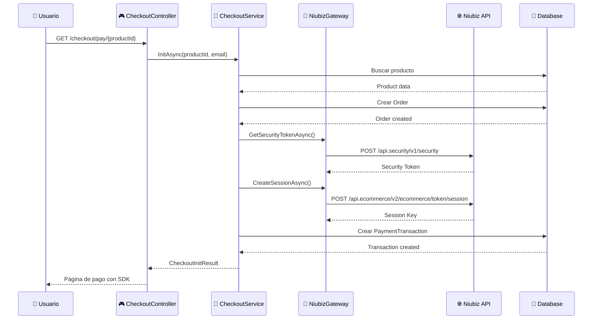
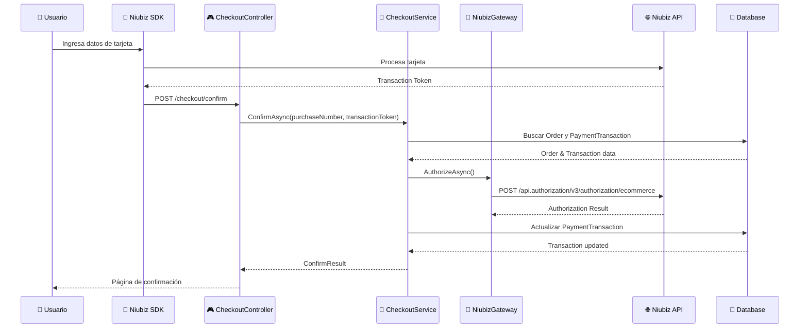

# 🏗️ Arquitectura del Sistema

## Visión General de la Arquitectura

Este documento detalla la arquitectura Clean Architecture implementada en el proyecto de integración con Niubiz.

## 📊 Diagrama de Componentes

```mermaid
graph TB
    subgraph "🎨 Capa de Presentación"
        PC[ProductsController]
        CC[CheckoutController]
        HC[HomeController]
        V[Views/Razor]
        JS[JavaScript/SDK]
    end

    subgraph "🧠 Capa de Aplicación"
        CS[CheckoutService]
        PS[ProductService]
        ICS[ICheckoutService]
        IPS[IProductService]
        ING[INiubizGateway]
        DTO[DTOs]
    end

    subgraph "🔧 Capa de Infraestructura"
        NC[NiubizClient]
        NO[NiubizOptions]
        HC_HTTP[HttpClient]
        DI[DependencyInjection]
    end

    subgraph "💾 Capa de Persistencia"
        DBContext[AppDbContext]
        PR[ProductRepository]
        OR[OrderRepository]
        PAR[PaymentRepository]
        DB[(SQLite Database)]
    end

    subgraph "🏛️ Capa de Dominio"
        PE[Product Entity]
        OE[Order Entity]
        PTE[PaymentTransaction Entity]
    end

    subgraph "🌐 Servicios Externos"
        NAPI[Niubiz API]
        SDK[Niubiz SDK]
    end

    %% Conexiones
    PC --> IPS
    CC --> ICS
    CS --> ING
    CS --> OR
    CS --> PAR
    PS --> PR
    NC --> NAPI
    NC --> NO
    NC --> HC_HTTP
    OR --> DBContext
    PR --> DBContext
    PAR --> DBContext
    DBContext --> DB
    DBContext --> PE
    DBContext --> OE
    DBContext --> PTE
    JS --> SDK
    V --> JS

    %% Estilos
    classDef presentation fill:#e1f5fe
    classDef application fill:#f3e5f5
    classDef infrastructure fill:#fff3e0
    classDef persistence fill:#e8f5e8
    classDef domain fill:#fce4ec
    classDef external fill:#f5f5f5

    class PC,CC,HC,V,JS presentation
    class CS,PS,ICS,IPS,ING,DTO application
    class NC,NO,HC_HTTP,DI infrastructure
    class DBContext,PR,OR,PAR,DB persistence
    class PE,OE,PTE domain
    class NAPI,SDK external
```



## 🔄 Flujo de Datos

### 1. Flujo de Inicialización de Pago



### 2. Flujo de Confirmación de Pago



## 🏗️ Patrones de Diseño Implementados

### 1. Repository Pattern
```csharp
public interface IProductRepository
{
    Task<Product?> GetByIdAsync(Guid id, CancellationToken ct = default);
    Task<IEnumerable<Product>> GetAllAsync(CancellationToken ct = default);
    Task AddAsync(Product product, CancellationToken ct = default);
}
```

**Beneficios:**
- Abstracción del acceso a datos
- Facilita testing con mocks
- Permite cambiar el ORM sin afectar la lógica

### 2. Dependency Injection
```csharp
services.AddScoped<ICheckoutService, CheckoutService>();
services.AddScoped<INiubizGateway, NiubizClient>();
services.AddHttpClient<NiubizClient>();
```

**Beneficios:**
- Bajo acoplamiento
- Fácil testing
- Configuración centralizada

### 3. Options Pattern
```csharp
services.Configure<NiubizOptions>(configuration.GetSection("Niubiz"));
```

**Beneficios:**
- Configuración fuertemente tipada
- Validación automática
- Soporte para múltiples ambientes

### 4. Adapter Pattern (NiubizClient)
```csharp
public class NiubizClient : INiubizGateway
{
    // Adapta la API REST de Niubiz a nuestras interfaces
}
```

**Beneficios:**
- Aísla dependencias externas
- Facilita cambios en APIs externas
- Mejora la testabilidad

## 📦 Módulos y Responsabilidades

### Capa de Presentación (Web)
| Componente | Responsabilidad |
|------------|-----------------|
| `ProductsController` | Gestión de la visualización de productos |
| `CheckoutController` | Manejo del flujo de pago |
| `HomeController` | Página principal |
| `Views` | Templates Razor para UI |
| `wwwroot` | Contenido estático (CSS, JS, imágenes) |

### Capa de Aplicación
| Componente | Responsabilidad |
|------------|-----------------|
| `CheckoutService` | Orquestación del proceso de pago |
| `ProductService` | Lógica de negocio de productos |
| `ICheckoutService` | Contrato del servicio de checkout |
| `INiubizGateway` | Contrato para integración con Niubiz |
| `DTOs` | Objetos de transferencia de datos |

### Capa de Infraestructura
| Componente | Responsabilidad |
|------------|-----------------|
| `NiubizClient` | Cliente HTTP para API de Niubiz |
| `NiubizOptions` | Configuración de Niubiz |
| `DependencyInjection` | Registro de servicios en DI container |

### Capa de Persistencia
| Componente | Responsabilidad |
|------------|-----------------|
| `AppDbContext` | Contexto de Entity Framework |
| `ProductRepository` | Acceso a datos de productos |
| `OrderRepository` | Acceso a datos de órdenes |
| `PaymentRepository` | Acceso a datos de pagos |

### Capa de Dominio
| Componente | Responsabilidad |
|------------|-----------------|
| `Product` | Entidad de producto |
| `Order` | Entidad de orden de compra |
| `PaymentTransaction` | Entidad de transacción de pago |

## 🔐 Consideraciones de Seguridad

### 1. Manejo de Credenciales
- Uso de **User Secrets** en desarrollo
- Variables de entorno en producción
- Nunca credenciales hardcodeadas

### 2. Validación de Datos
- Validación en el servidor siempre
- Sanitización de inputs
- Validación de montos y formatos

### 3. Comunicación Segura
- HTTPS obligatorio
- Tokens con expiración
- Validación de origen de requests

### 4. Logging Seguro
- No logear información sensible
- Logs estructurados
- Monitoreo de errores

## 📈 Escalabilidad y Performance

### Estrategias Implementadas

1. **Async/Await**: Todas las operaciones I/O son asíncronas
2. **HttpClient Reutilizable**: Usando HttpClientFactory
3. **Connection Pooling**: Entity Framework maneja el pool
4. **Caching**: Potencial para implementar cache de productos

### Métricas Recomendadas

```csharp
// Ejemplo de métricas con Application Insights
public class NiubizClient : INiubizGateway
{
    private readonly ILogger<NiubizClient> _logger;
    
    public async Task<string> GetSecurityTokenAsync()
    {
        using var activity = _logger.BeginScope("GetSecurityToken");
        var stopwatch = Stopwatch.StartNew();
        
        try
        {
            // Lógica del método
            return result;
        }
        finally
        {
            _logger.LogInformation("GetSecurityToken completed in {Duration}ms", 
                stopwatch.ElapsedMilliseconds);
        }
    }
}
```

## 🧪 Estrategia de Testing

### 1. Unit Tests
```csharp
[Test]
public async Task CheckoutService_InitAsync_ShouldReturnValidResult()
{
    // Arrange
    var mockProductRepo = new Mock<IProductRepository>();
    var mockNiubizGateway = new Mock<INiubizGateway>();
    // ... setup mocks
    
    var service = new CheckoutService(mockProductRepo.Object, /*...*/);
    
    // Act
    var result = await service.InitAsync(productId, email);
    
    // Assert
    Assert.That(result.Amount, Is.GreaterThan(0));
    Assert.That(result.SessionKey, Is.Not.Null);
}
```

### 2. Integration Tests
```csharp
[Test]
public async Task NiubizClient_GetSecurityToken_ShouldReturnValidToken()
{
    // Arrange
    var httpClient = new HttpClient();
    var options = new NiubizOptions { /* test config */ };
    var client = new NiubizClient(httpClient, Options.Create(options), logger);
    
    // Act
    var token = await client.GetSecurityTokenAsync();
    
    // Assert
    Assert.That(token, Is.Not.Empty);
}
```

### 3. End-to-End Tests
```csharp
[Test]
public async Task CompletePaymentFlow_ShouldProcessSuccessfully()
{
    // Simular flujo completo desde inicio hasta confirmación
}
```

## 🔄 Mantenimiento y Monitoreo

### Health Checks
```csharp
services.AddHealthChecks()
    .AddDbContextCheck<AppDbContext>()
    .AddUrlGroup(new Uri("https://apisandbox.vnforapps.com/api.security/v1/security"), 
                 "Niubiz API");
```

### Logging Estructurado
```csharp
_logger.LogInformation("Payment initiated for {ProductId} by {CustomerEmail} " +
                      "with amount {Amount} {Currency}", 
                      productId, customerEmail, amount, currency);
```

### Métricas de Negocio
- Tasa de conversión de pagos
- Tiempo promedio de procesamiento
- Errores por tipo
- Volumen de transacciones