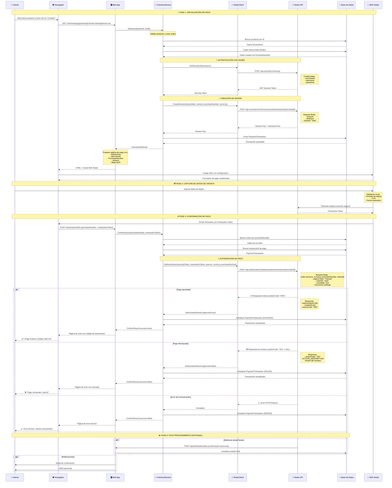
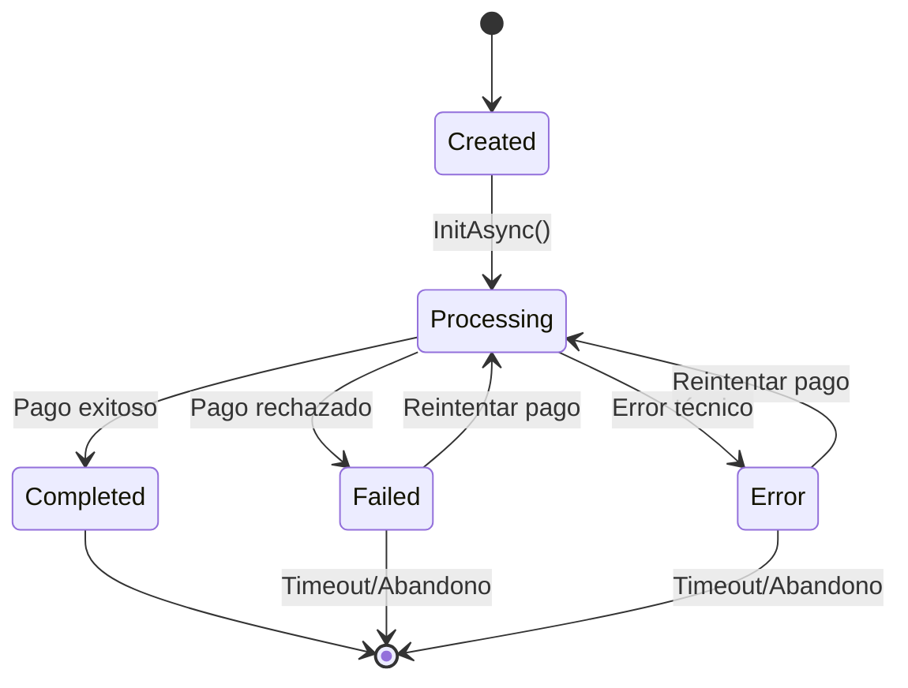
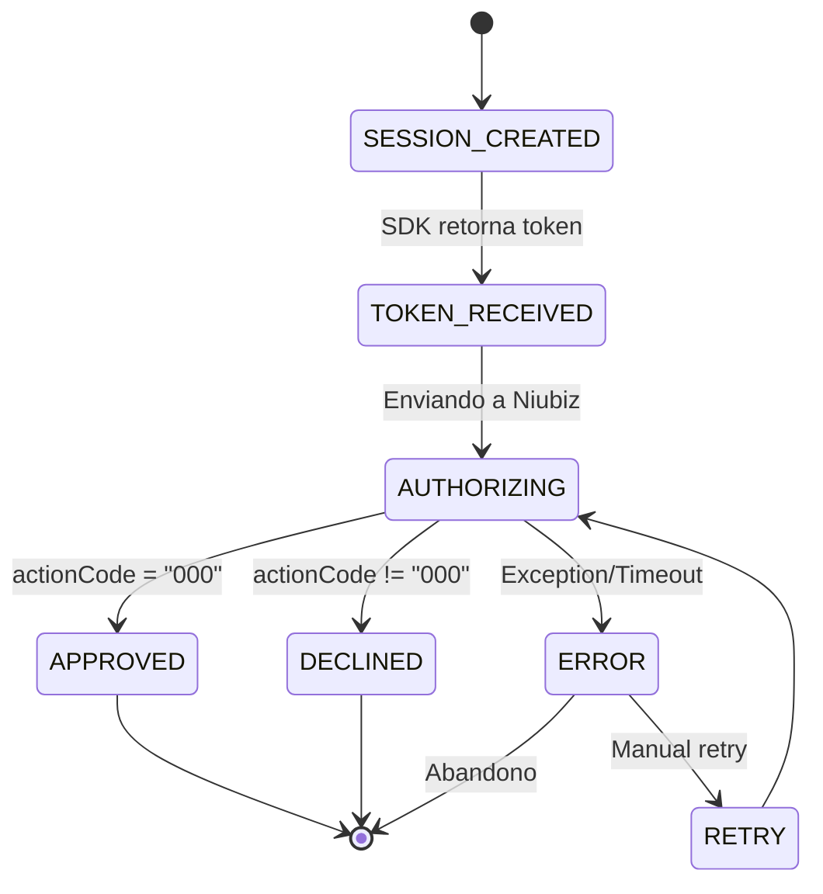
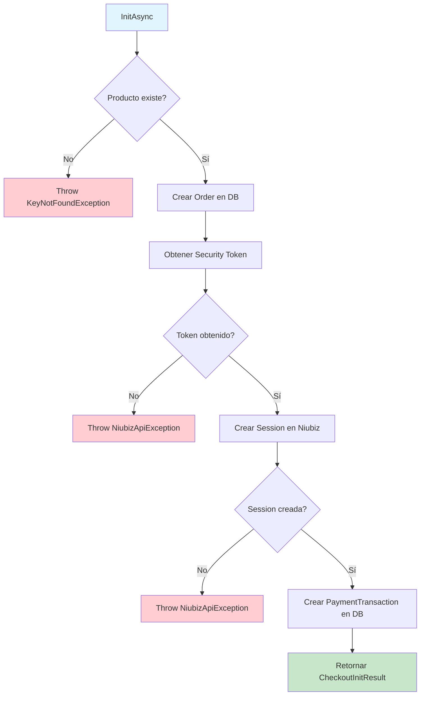
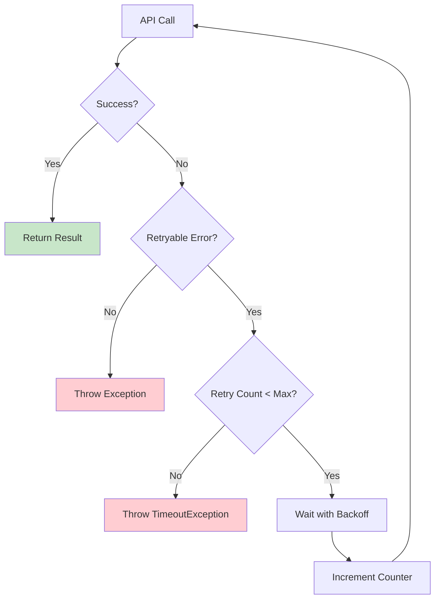

# 🔄 Flujo de Pago Niubiz - Documentación Técnica

## Diagrama de Secuencia Completo



## Estados de las Entidades

### Ciclo de Vida de Order



### Estados de PaymentTransaction



## Flujo de Datos Detallado

### 1. Inicialización (CheckoutService.InitAsync)



### 2. Confirmación (CheckoutService.ConfirmAsync)

```mermaid
flowchart TD
    A[ConfirmAsync] --> B{Order existe?}
    B -->|No| B1[Throw KeyNotFoundException]
    B -->|Sí| C{PaymentTransaction existe?}
    C -->|No| C1[Throw InvalidOperationException]
    C -->|Sí| D[Obtener Security Token]
    D --> E[Llamar Niubiz Authorization API]
    E --> F{Respuesta de Niubiz}
    F -->|actionCode = "000"| G[Actualizar como APPROVED]
    F -->|actionCode != "000"| H[Actualizar como DECLINED]
    F -->|Exception| I[Actualizar como ERROR]
    G --> J[Retornar Success=true]
    H --> K[Retornar Success=false]
    I --> L[Retornar Success=false con error]

    style A fill:#e1f5fe
    style J fill:#c8e6c9
    style K fill:#fff3e0
    style L fill:#ffcdd2
    style B1 fill:#ffcdd2
    style C1 fill:#ffcdd2
```

## Configuración de Endpoints Niubiz

### Ambientes Disponibles

| Ambiente | Base URL | Propósito |
|----------|----------|-----------|
| **QA/Sandbox** | `https://apisandbox.vnforapps.com` | Desarrollo y pruebas |
| **Producción** | `https://apiprod.vnforapps.com` | Transacciones reales |

### Endpoints Específicos

#### 1. Security Token
- **URL**: `/api.security/v1/security`
- **Método**: POST
- **Propósito**: Autenticación inicial

```json
POST /api.security/v1/security
Content-Type: application/json

{
  "merchantId": "123456789",
  "username": "tu_usuario",
  "password": "tu_password"
}
```

#### 2. Session Creation
- **URL**: `/api.ecommerce/v2/ecommerce/token/session/{merchantId}`
- **Método**: POST
- **Propósito**: Crear sesión de pago

```json
POST /api.ecommerce/v2/ecommerce/token/session/123456789
Authorization: Bearer {security_token}
Content-Type: application/json

{
  "amount": 99.99,
  "antifraud": {
    "clientIp": "192.168.1.100",
    "merchantDefineData": {
      "MDD4": "cliente@email.com",
      "MDD21": "0",
      "MDD32": "231215143022",
      "MDD75": "Registrado",
      "MDD77": "999"
    }
  },
  "channel": "web"
}
```

#### 3. Authorization
- **URL**: `/api.authorization/v3/authorization/ecommerce/{merchantId}`
- **Método**: POST
- **Propósito**: Autorizar transacción

```json
POST /api.authorization/v3/authorization/ecommerce/123456789
Authorization: Bearer {security_token}
Content-Type: application/json

{
  "antifraud": null,
  "captureType": "manual",
  "channel": "web",
  "countable": true,
  "order": {
    "amount": 99.99,
    "currency": "PEN",
    "purchaseNumber": "231215143022",
    "tokenId": "transaction_token_from_sdk"
  },
  "recurrence": {
    "amount": 99.99,
    "beneficiaryId": "0",
    "frequency": "FALSE",
    "maxAmount": 99.99,
    "type": ""
  }
}
```

## Códigos de Respuesta Niubiz

### Action Codes Principales

| Código | Descripción | Acción Recomendada |
|--------|-------------|-------------------|
| `000` | ✅ Transacción aprobada | Procesar como exitosa |
| `101` | ❌ Tarjeta expirada | Solicitar tarjeta válida |
| `102` | ❌ Tarjeta restringida | Contactar banco |
| `104` | ❌ Monto no permitido | Verificar límites |
| `106` | ❌ PIN incorrecto | Reintentar |
| `107` | ❌ Tarjeta no válida | Verificar datos |
| `201` | ❌ Tarjeta rechazada | Usar otra tarjeta |
| `202` | ❌ Tarjeta robada | Bloquear y reportar |
| `203` | ❌ Tarjeta perdida | Bloquear y reportar |
| `291` | ⚠️ Banco no disponible | Reintentar más tarde |
| `999` | ⚠️ Error del sistema | Contactar soporte |

### HTTP Status Codes

| Status | Significado | Manejo en la App |
|--------|-------------|------------------|
| `200` | OK | Procesar response |
| `400` | Bad Request | Validar parámetros |
| `401` | Unauthorized | Renovar token |
| `403` | Forbidden | Verificar permisos |
| `500` | Internal Server Error | Reintentar o fallar |
| `503` | Service Unavailable | Reintentar más tarde |

## Configuración de Timeouts

### Timeouts Recomendados

```csharp
services.AddHttpClient<NiubizClient>(client =>
{
    client.Timeout = TimeSpan.FromMinutes(2); // Total timeout
});

// En NiubizClient
var cts = new CancellationTokenSource(TimeSpan.FromSeconds(30));
var response = await _httpClient.SendAsync(request, cts.Token);
```

### Timeouts por Endpoint

| Endpoint | Timeout Recomendado | Razón |
|----------|-------------------|-------|
| Security Token | 15 segundos | Autenticación rápida |
| Create Session | 20 segundos | Procesos antifraude |
| Authorization | 45 segundos | Validación bancaria |

## Manejo de Errores y Retry Logic

### Estrategia de Reintentos



### Errores que Permiten Retry

- `HttpRequestException` (problemas de red)
- `TaskCanceledException` (timeout)
- HTTP 500, 502, 503, 504
- HTTP 429 (Rate limiting)

### Errores que NO Permiten Retry

- HTTP 400 (Bad Request)
- HTTP 401 (Unauthorized)
- HTTP 403 (Forbidden)
- HTTP 404 (Not Found)

## Configuración de Logging

### Niveles de Log por Componente

```json
{
  "Logging": {
    "LogLevel": {
      "Default": "Information",
      "IntegracionNiubizDemo.Infrastructure.Niubiz.NiubizClient": "Debug",
      "IntegracionNiubizDemo.Application.Services.CheckoutService": "Information",
      "System.Net.Http.HttpClient": "Warning",
      "Microsoft.EntityFrameworkCore": "Warning"
    }
  }
}
```

### Eventos de Log Importantes

```csharp
// Nivel Debug - Detalles técnicos
_logger.LogDebug("Enviando request a Niubiz: {Endpoint} - Body: {RequestBody}", endpoint, requestBody);

// Nivel Information - Flujo de negocio
_logger.LogInformation("Pago iniciado para producto {ProductId} por monto {Amount} {Currency}", productId, amount, currency);

// Nivel Warning - Situaciones recuperables
_logger.LogWarning("Pago rechazado para compra {PurchaseNumber} - Código: {ActionCode}", purchaseNumber, actionCode);

// Nivel Error - Errores que requieren intervención
_logger.LogError(ex, "Error de comunicación con Niubiz para compra {PurchaseNumber}", purchaseNumber);
```

## Métricas y Monitoreo

### KPIs Importantes

1. **Tasa de Éxito**: % de pagos aprobados vs iniciados
2. **Tiempo de Respuesta**: Latencia promedio de APIs Niubiz
3. **Rate de Error**: % de errores técnicos
4. **Abandono**: % de sesiones iniciadas vs completadas

### Health Checks

```csharp
services.AddHealthChecks()
    .AddCheck<NiubizHealthCheck>("niubiz-api")
    .AddDbContextCheck<AppDbContext>("database");
```

Este flujo documenta completamente el proceso de integración con Niubiz, desde la perspectiva técnica hasta la experiencia del usuario.